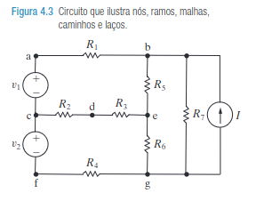

# Análise de Circuitos Elétricos
## Aula 03 - Leis de Kirchoff e Instrumentos Para Medição de Grandezas
 
Prof. M.Sc. Diego Ascânio Santos (ascanio@cefetmg.br)

Aula baseada sobre o material do professor Dr. Emerson Gonçalves de Melo (emerdemelo@usp.br - DEMAR EEL USP), da professora Dra. Thabatta Moreira Alves de Araújo (thabatta@cefetmg.br - DIGDDV) e da Khan Academy.

CEFET-MG DIGGDDV - Divinópolis, 2023.

---

# Roteiro

1. Definições, Terminações e Nomenclaturas
    1. Elementos
    2. Nós
    3. Malhas
    4. Tabela de Terminações e Nomenclaturas
2. Lei de Kirchoff da Corrente
3. Lei de Kirchoff da Tensão

---

# Roteiro

4. Análise de circuitos pelas Leis de Kirchoff da Corrente e da Tensão
    1. Construção de Sistemas de Equações Lineares à Partir do Método Thabatta / Khan Academy
    2. Representação dos Sistemas de Equações Lineares em Sua Forma Matricial
    3. Resolução dos Sistemas Lineares por Sistemas Computacionais de Álgebra (CAS - sympy, numpy)

---

# Roteiro

5. Instrumentos de medida de grandezas elétricas
    1. Voltímetro (Tensão)
    2. Amperímetro (Corrente)
    3. Ohmímetro (Resistência)
    4. Multímetro (Múltiplas Grandezas)
6. Lista 3 de Exercícios

---

<!-- _class: lead -->
# Definições, Terminações e Nomenclaturas

---

    Definições - Elementos

Elementos de circuitos são os componentes presentes em um circuito elétrico como resistores, capacitores, indutores, baterias, fontes (tensão / corrente), chaves, dentre outros.

    

        <figure>
            
            <figcaption>Exemplos de Elementos de Circuitos.</figcaption>
        </figure>
        <figure>
            
            <figcaption>Circuito composto por resistor, capacitor e indutor.</figcaption>
        </figure>
    

---

    Definições - Nós

Um nó é um ponto em circuito elétrico que conecta dois ou mais de seus elementos.

    

        <figure>
            
            <figcaption>Nós em Um Circuito Elétrico </figcaption>
        </figure>
    

---

    Definições - Malhas

Um laço é qualquer caminho contínuo e fechado em um circuito que começa e termina no mesmo nó.

    <figure>
        
        <figcaption class="regular">Laços (destacados em laranja) presentes em um circuito </figcaption>
    </figure>

Uma malha é um laço (caminho contínuo e fechado em um circuito) que não apresenta outros laços dentro dele.

    <figure>
        
        <figcaption class="regular">Exemplo de Circuito Com Três Malhas Dentro Dele </figcaption>
    </figure>

---

Referência de Terminações e Nomenclaturas em Um Circuito

    

    

---

<!-- _class: lead -->
# Lembrete nº 1

<!-- _class: lead -->
## Não Adianta a Sua Matemática Estar Correta se Seu Modelo Estiver Errado!

<!-- _class: lead -->
Um circuito só está resolvido quando os valores das correntes e tensões de seus elementos são conhecidos!

---

<!-- _class: lead -->
# Lei de Kirchoff das Correntes em Um Nó

---

Lei de Kirchoff das Correntes

A Lei de Kirchhoff das Correntes diz que a soma das correntes que entram em um nó de um circuito tem de ser igual a soma das correntes que saem dele:

$$
    \sum{i_{\text{entrada}}} = \sum{i_{\text{saida}}}
$$

Considerando o nó abaixo, temos as correntes $i_{1}, i_{3} \text{ e } i_{4}$ entrando no nó, enquanto as correntes $i_{2} \text{ e } i_{5}$ saem dele.

Assim, $i_{1} + i_{3} + i_{4} = i_{2} + i_{5}$

---

<!-- _class: lead -->
# Lei de Kirchoff das Tensões em Uma Malha

---

Lei de Kirchoff das Tensões 

A Lei de Kirchhoff das Tensões diz que a soma das $n$ tensões presentes em (em torno de) uma malha fechada é zero:

$$
    \sum_{n}{V_{n}} = 0 
$$

A Lei de Kirchhoff das Tensões também pode ser descrita de outra forma: A soma dos aumentos de tensão é igual à soma das quedas de tensão em torno de uma malha fechada:
<!-- Guardem isso, pois, isso é de suma importância! -->

$$
    \sum_{V_{\text{aumento}}} = \sum_{V_{\text{queda}}} 
$$

Observe as setas laranjas, as que transitam de negativo pra positivo, representam um aumento de tensão. As que transitam de positivo para negativo, uma diminuição (subtração) da tensão.

Escrevendo a LKT desta malha pela primeira equação: $+20V - 2V - 4V - 6V - 8V = 0V$.

Considerando que a soma das tensões de queda é de $20V$, pela segunda equação, temos que $20V = 2V + 4V + 6V + 8V$

---

<!-- _class: lead -->
# Lembrete nº 2

<!-- _class: lead -->
## Não Adianta a Sua Matemática Estar Correta se Seu Modelo Estiver Errado!

<!-- _class: lead -->
Um circuito só está resolvido quando os valores das correntes e tensões de seus elementos são conhecidos!
