

# Análise de Circuitos Elétricos
## Aula 03 - Leis de Kirchoff, Resolução de Circuitos Pelas Leis de Kirchoff, Método das Tensões de Nós, Método das Correntes de Malha e Instrumentos Para Medição de Grandezas
 
Prof. M.Sc. Diego Ascânio Santos (ascanio@cefetmg.br)

Aula baseada sobre o material do professor Dr. Emerson Gonçalves de Melo (emerdemelo@usp.br - DEMAR EEL USP), da professora Dra. Thabatta Moreira Alves de Araújo (thabatta@cefetmg.br - DIGDDV), da Khan Academy e do professor Dr. Thomas G. Cleaver (tom.cleaver@louisville.edu) da universidade de Louisville.

CEFET-MG DIGGDDV - Divinópolis, 2024.

---

# Roteiro

1. Fontes, Linearidade, Sobreposição e Homogeneidade
2. Definições, Terminações e Nomenclaturas
    1. Elementos
    2. Nós
    3. Malhas
    4. Tabela de Terminações e Nomenclaturas
3. Lei de Kirchoff da Corrente
4. Lei de Kirchoff da Tensão

---

# Roteiro

5. Análise de circuitos pelas Leis de Kirchoff da Corrente e da Tensão
    1. Método para modelagem de circuitos em Sistemas de Equações Lineares
    2. Representação dos Sistemas de Equações Lineares em Sua Forma Matricial
    3. Resolução dos Modelos de Circuitos em Equações Lineares por Sistemas Computacionais de Álgebra (CAS - sympy, numpy)

---

# Roteiro

6. Método das Tensões nos Nós
7. Método das Correntes de Malhas
8. Instrumentos de medida de grandezas elétricas
    1. Voltímetro (Tensão)
    2. Amperímetro (Corrente)
    3. Ohmímetro (Resistência)
    4. Multímetro (Múltiplas Grandezas)
9. Listas de Exercícios

---

<!-- _class: lead -->

# Fontes, Linearidade, Sobreposição e Homogeneidade

---

## Fontes

- Fontes de tensão e corrente são ditas independentes quando não são influenciadas por qualquer outra corrente ou tensão no circuito. 
    - Sua representação gráfica consiste em um circulo com os pólos positivo e negativo (quando se trata de uma fonte de tensão) ou um circulo com uma seta (quando se trata de uma fonte de corrente).

- Quando os valores de uma fonte de tensão ou corrente são determinados por outra tensão ou corrente do circuito, então dizemos que estas fontes são dependentes.
    - Na imagem da fonte dependente de tensão (corrente), verificamos que sua tensão \\(V_{s} = 3 V_{x}\\) (corrente \\(i_{s} = 3 V_{x}\\)) é dependente da tensão \\(V_{x} = 5V\\) presente entre os pontos \\(a\\) e \\(b\\) do circuito, onde \\(V_{x}\\) também corresponde à tensão da fonte de tensão independente do circuito.

- A representação gráfica das fontes dependentes consistem em um losango contendo pólos \\(-\\) quando a fonte dependente fornece tensão \\(-\\) ou um losango contendo uma seta \\(-\\) quando a fonte dependente fornece corrente.

<figure>

<!-- _class: transparent -->

<figcaption>Circuito com fonte dependente de Tensão</figcaption>

</figure>

<figure>

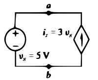

<figcaption>Circuito com fonte dependente de Corrente</figcaption>

</figure>

---

## Linearidade e Superposição

- Toda função matemática é linear quando ela é FECHADA na adição (propriedade da aditividade - superposição) e na multiplicação por escalar (propriedade da homogeneidade - linearidade).
    - FECHADA implica dizer que ao adicionar funções lineares ou multiplicar uma função linear por um valor escalar produzo outra função linear resultante (Conceitos oriundos da álgebra linear, não serão desenvolvidos a fundo por fugirem do escopo da disciplina).

- A função da Lei de Ohm, representada por \\(V(t) = Ri(t)\\) é uma função linear (toda função linear é da forma \\(y = ax + b)\\).
- Assim, pelos princípios da superposição e linearidade, circuitos elétricos resistivos (capacitivos e indutivos em situações específicas) são equivalentes a sistemas de equações lineares.
    - Por isso, conseguimos resolver circuitos usando sistemas lineares.

---

## Homogeneidade, Sobreposição e a Produção de Circuitos Equivalentes

- A homogeneidade nos ajuda a atribuir arbitrariamente valores para elementos dos circuitos e, consequentemente, deduzir demais grandezas, por garantir que as multiplicações por valores escalares persistem a produzir elementos lineares.

- A sobreposição de circuitos nos permite deduzir que a as grandezas de um elemento podem ser calculadas levando-se em consideração a contribuição individual de elementos de circuito sobre eles, pois, a propriedade da adição garante que a adição de funções lineares continua a produzir outra função linear.

- Diante disso tudo, estes princípios nos permitem deduzir (e verificar) a existência de circuitos equivalentes, pois, ao garantirem que a sobreposição e homogeneidade produzem funções lineares, logo, formas distintas de se produzirem o mesmo circuito se equivalem, como será visto nas próximas aulas.

---

<!-- _class: lead -->
# Definições, Terminações e Nomenclaturas

---

    Definições - Elementos

Elementos de circuitos são os componentes presentes em um circuito elétrico como resistores, capacitores, indutores, baterias, fontes (tensão / corrente), chaves, dentre outros.

    

        <figure>
            
            <figcaption>Exemplos de Elementos de Circuitos.</figcaption>
        </figure>
        <figure>
            
            <figcaption>Circuito composto por resistor, capacitor e indutor.</figcaption>
        </figure>
    

---

    Definições - Nós

Um nó é um ponto em circuito elétrico que conecta dois ou mais de seus elementos.

    

        <figure>
            
            <figcaption>Nós em Um Circuito Elétrico </figcaption>
        </figure>
    

---

    Definições - Malhas

Um laço é qualquer caminho contínuo e fechado em um circuito que começa e termina no mesmo nó.

    <figure>
        
        <figcaption class="regular">Laços (destacados em laranja) presentes em um circuito </figcaption>
    </figure>

Uma malha é um laço (caminho contínuo e fechado em um circuito) que não apresenta outros laços dentro dele.

    <figure>
        
        <figcaption class="regular">Exemplo de Circuito Com Três Malhas Dentro Dele </figcaption>
    </figure>

---

Referência de Terminações e Nomenclaturas em Um Circuito

    

    

---

<!-- _class: lead -->
# Lembrete nº 1

<!-- _class: lead -->
## Não Adianta a Sua Matemática Estar Correta se Seu Modelo Estiver Errado!

<!-- _class: lead -->
Um circuito só está resolvido quando os valores das correntes e tensões de seus elementos são conhecidos!

---

<!-- _class: lead -->
# Lei de Kirchoff das Correntes em Um Nó

---

Lei de Kirchoff das Correntes

A Lei de Kirchhoff das Correntes diz que a soma das correntes que entram em um nó de um circuito tem de ser igual a soma das correntes que saem dele:

$$
    \sum{i_{\text{entrada}}} = \sum{i_{\text{saida}}}
$$

Considerando o nó abaixo, temos as correntes $i_{1}, i_{3} \text{ e } i_{4}$ entrando no nó, enquanto as correntes $i_{2} \text{ e } i_{5}$ saem dele.

Assim, $i_{1} + i_{3} + i_{4} = i_{2} + i_{5}$

---

<!-- _class: lead -->
# Lei de Kirchoff das Tensões em Uma Malha

---

Lei de Kirchoff das Tensões 

A Lei de Kirchhoff das Tensões diz que a soma das $n$ tensões presentes em (em torno de) uma malha fechada é zero:

$$
    \sum_{n}{V_{n}} = 0 
$$

A Lei de Kirchhoff das Tensões também pode ser descrita de outra forma: A soma dos aumentos de tensão é igual à soma das quedas de tensão em torno de uma malha fechada:
<!-- Guardem isso, pois, isso é de suma importância! -->

$$
    \sum_{V_{\text{aumento}}} = \sum_{V_{\text{queda}}} 
$$

Observe as setas laranjas, as que transitam de negativo pra positivo, representam um aumento de tensão. As que transitam de positivo para negativo, uma diminuição (subtração) da tensão.

Escrevendo a LKT desta malha pela primeira equação: $+20V - 2V - 4V - 6V - 8V = 0V$.

Considerando que a soma das tensões de queda é de $20V$, pela segunda equação, temos que $20V = 2V + 4V + 6V + 8V$

---

<!-- _class: lead -->
# Lembrete nº 2

<!-- _class: lead -->
## Não Adianta a Sua Matemática Estar Correta se Seu Modelo Estiver Errado!

<!-- _class: lead -->
Um circuito só está resolvido quando os valores das correntes e tensões de seus elementos são conhecidos!

---

# Método para determinação do sentido das correntes e das equações de malha para a obtenção de equações lineares que resolvem um circuito resistivo.

Consideramos que um circuito está resolvido quando sabemos todos os valores de seus componentes e das correntes que circulam por eles, pois aí, conseguimos derivar as demais grandezas de interesse.

---

## Método para determinação do sentido das correntes e das equações de malha para a obtenção de equações lineares que resolvem um circuito resistivo.

- Como resolver o circuito ao lado, em função de $R$ e depois, descobrir o valor de $R$ sabendo que uma corrente de $3A$ passa pelo resistor de $9\Omega$?

- Através do Algoritmo explicado nos próximos slides!

<!-- _class: transparent -->

---

## Algoritmo para resolução de circuitos pela lei de Kirchhoff (passo-a-passo) 

Dado um circuito qualquer:

1. Determine quais são os elementos (resistores e fontes) do circuito e identifique-os;
2. Atribua uma corrente (arbitrando sua direção) em cada elemento. Elementos no mesmo ramo (em série entre dois nós) devem ser atribuídos à mesma corrente. Não se esqueça de atribuir correntes às fontes de tensão;
3. Atribua uma tensão a cada elemento. Se for um resistor, indutor ou capacitor, o sinal + deve ser colocado onde a corrente entra no elemento. Não se esqueça de atribuir tensões às fontes de correntes (se existirem).
4. Determine quais são os nós essenciais do circuito (ponto onde três ou mais elementos se juntam);
5. Determine quais são as malhas (Caminhos (laços) cujos nó inicial e final se coincidem sem englobar nenhum outro laço) do circuito;
6. Levando em conta a lei de Kirchhoff da corrente, que afirma que a soma das correntes entrando em um nó é igual àquelas que saem, identifique o comportamento das correntes nos nós;

---

## Algoritmo para resolução de circuitos pela lei de Kirchhoff (passo-a-passo) 

7. Escreva as diferenças de potencial existentes em uma malha levando em consideração a lei de kirchoff da tensão, que estabelece que a soma das diferenças de potencial dos elementos de uma malha é igual a zero.
    - Aqui a sinalização dos pontos onde ocorrem quedas de pontecial nos resistores será essencial, pois:
        - Se em um ponto da malha, o caminho da malha se mover de um ponto de menor tensão (-) para um ponto de maior tensão (+) em um resistor, você deve considerar um aumento de tensão nesse caminho. 
        - Se o caminho se mover de um ponto de maior tensão para um ponto de menor tensão, você deve considerar um decréscimo de tensão no caminho da malha.
8. Escreva equações da lei de Ohm (V = Ri) para cada resistor do circuito.
9. A partir das equações de corrente obtidas em 6, 7 e 8, se você seguiu o método corretamente, você produziu um modelo matemático adequado para o comportamento de circuito e ele pode ser resolvido através de sistemas lineares. IMPORTANTE: o número de equações obtidas deve ser igual ao número de incógnitas (valores desconhecidos) que representam os elementos do circuito.

**Lembrando: Não adianta sua matemática estar correta se seu modelo estiver errado!**

---

## Algoritmo

### Passo 1

Considerando o circuito da figura, queremos resolvê-lo calculando o valor de todas as correntes de seus componentes em função do resistor de valor desconhecido $R$. **Para resolver o circuito ao final do algoritmo, bem como encontrar o valor de $R$, sabemos que no resistor de $9 \Omega$ passa uma corrente de $3A$.**

Ao aplicar o passo 1 do algoritmo, os resistores identificados encontram-se contornados por linhas vermelhas e a fonte identificada por uma linha laranja:

<!-- _class: transparent -->

---

## Algoritmo

### Passo 2

Ao aplicar o passo 2, arbitramos 6 correntes às resistências e às fontes do circuito:

1. $i_{0}$ na fonte
2. $i_{1}$ nos resistores de $9\Omega$ e $6\Omega$
3. $i_{2}$ em $R$
4. $i_{3}$ no resistor de $5\Omega$
5. $i_{4}$ no resistor de $30 \Omega$
6. $i_{5}$ nos resistores de $10\Omega$ e $6\Omega$.

<!-- _class: transparent -->
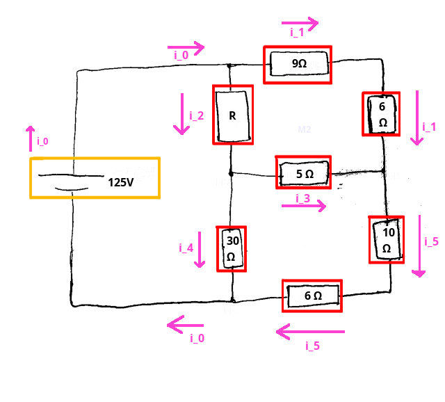

---

## Algoritmo

### Passo 3

Ao aplicar o passo 3, definimos 7 tensões (com polaridades regidas pelas correntes) nas resistências do circuito:

1. $V_{a}$ no resistor $R$ desconhecido
2. $V_{b}$ no resistor de $9\Omega$
3. $V_{c}$ no resistor de $6\Omega$
4. $V_{d}$ no resistor de $5\Omega$
5. $V_{e}$ no resistor de $10\Omega$
6. $V_{f}$ no resistor de $6\Omega$
7. $V_{g}$ no resistor de $30\Omega$

<!-- _class: transparent -->
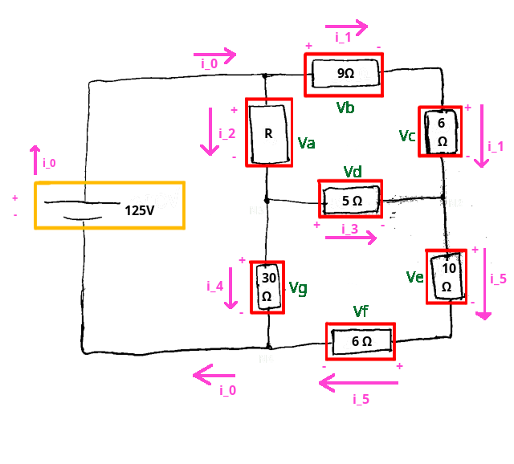

---

## Algoritmo

### Passo 4

Ao aplicar o passo 4, identificamos 4 nós essenciais no circuito:

1. $N_{1}$ que conecta a fonte, o resistor $R$ desconhecido e o resistor de $9\Omega$;
2. $N_{2}$ que conecta o resistor de $6\Omega$, o resistor de $5\Omega$ e o resistor de $10\Omega$;
3. $N_{3}$ que conecta o resistor $R$ desconhecido, o resistor de $5\Omega$ e o resistor de $30\Omega$;
4. $N_{4}$ que conecta a fonte, o resistor de $30\Omega$ e o resistor de $6\Omega$;

<!-- _class: transparent -->
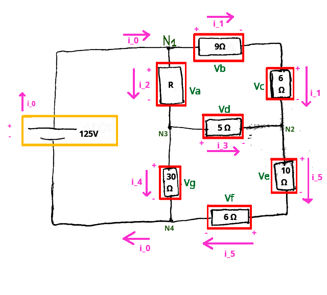

---

## Algoritmo

### Passo 5

Ao aplicar o passo 5, identificamos apenas três laços que não contém outros laços em seu interior e que, por isso, são malhas: $M_{1}$, $M_{2}$ e $M_{3}$ (sinalizados em azul):

<!-- _class: transparent -->
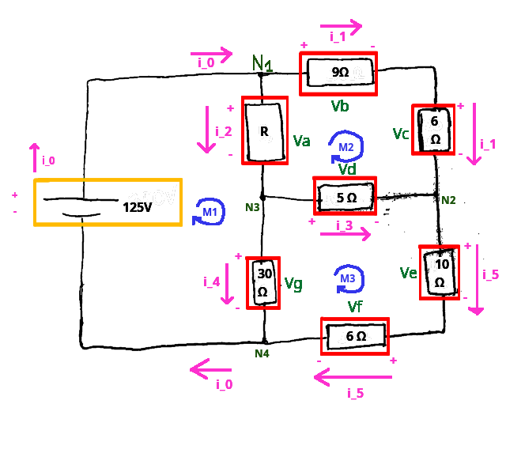

---

## Algoritmo

### Passo 6

Levando em conta a lei de Kirchhoff da corrente, que afirma que a soma das correntes entrando em um nó é igual àquelas que saem, identifique as correntes dos elementos do circuito e onde ocorrem quedas ou aumentos de tensão. 
- **ESSENCIAL:** Nos resistores, assinale um sinal positivo no ponto onde a corrente entra (maior tensão) e um negativo onde ela sai (menor tensão). Por fim, assinale os sinais positivos e negativos aos respectivos polos da(s) fonte(s). 

Cada elemento no circuito tem uma corrente que passa por ele. Começando pela fonte do circuito, temos uma corrente $i_{0}$ que flui do polo negativo da fonte em direção ao polo positivo. A corrente $i_{0}$ entra no nó $N_{1}$ e nesse nó ocorre uma ramificação do circuito para duas resistências: a resistência de valor indeterminado $R$ e a resistência de $9 \Omega$. 

Considerando a corrente que flui pelo resistor de $9 \Omega$ como $i_{1}$ e a corrente que flui por $R$ como $i_{2}$, como ambas $i_{1} \text{ e } i_{2}$ saem do nó $N_{1}$ e existe uma corrente $i_{0}$ que chega a este nó assim, pela LKC:

$$ i_{0} = i_{1} + i_{2} $$

<!-- _class: transparent -->

---

## Algoritmo

### Passo 6

Continuando a análise do circuito, verificamos que entre os nós $N_{1}$ e $N_{2}$ os resistores de $9 \Omega$ e de $6 \Omega$ estão em série, e portanto, possuem a mesma corrente $i_{1}$. Verificamos também que um resistor de $5 \Omega$ conecta os nós $N_{2}$ e $N_{3}$, existindo assim, uma corrente que circula neste elemento. O sentido de circulação da corrente deve ser definido arbitrariamente (a seu critério) e você pode definir tanto uma corrente $i_{3}$ que flui de $N_{2}$ para $N_{3}$ (direita para a esquerda) quanto de $N_{3}$ para $N_{2}$ (esquerda para a direita).

Nessa resolução, arbitraremos que a corrente $i_{3}$ flui de $N_{3}$ para $N_{2}$. Agora, escreveremos as equações da lei de Kirchhoff para a corrente para os nós $N_{3}$ e $N_{2}$ respectivamente. 
- No nó $N_{3}$ chega a corrente corrente $i_{2}$ que se divide para as correntes $i_{3}$ — que flui de $N_{3}$ para $N_{2}$ — e $i_{4}$ que passa no resistor de $30 \Omega$ entre $N_{3}$ e $N_{4}$.
    - Assim, a LKC no nó $N_{3}$ estabelece que $i_{2} = i_{3} + i_{4}$.
- No nó $N_{2}$ chegam as correntes $i_{1}$ e $i_{3}$ e sai uma corrente $i_{5}$ em direção aos dois resistores em série de $10 \Omega$ entre $N_{2}$ e $N_{4}$.
    - Assim, a LKC no nó $N_{2}$ estabelece que $i_{5} = i_{1} + i_{3}$

Por fim, em $N_{4}$ entram as correntes $i_{5}$ e $i_{4}$ que somadas produzem $i_{0}$ (que sai de $N_{4}$). Logo, $i_{4} + i_{5} = i_{0}$. Porém, essa equação não será utilizada, pois, é uma combinação das outras três equações de nós obtidas até o momento. Agora, devemos passar ao passo 7 - escrever as equações das tensões nas malhas $M_{1}, M_{2} \text{ e } M_{3}$ com base na lei de kirchoff da tensão.

<!-- _class: transparent -->

---

## Algoritmo

### Passo 7

Agora, devemos fazer as equações das tensões nas malhas pelos princípios da LKT que preconizam que a soma das diferenças de potencial em uma malha é sempre nula. Existe um subalgoritmo deste passo para fazer a resolução que para cada malha do circuito determina que você:

1. Escolha um elemento da malha como elemento atual
    - Na malha $M_{1}$, vamos escolher o elemento $R$.
2. Escolha um sentido (horário ou anti-horário) para percorrer a malha a partir do elemento escolhido. Escolheremos o sentido horário.

<!-- _class: transparent -->

---

## Algoritmo

### Passo 7

3. **(ESSENCIAL)** Avalie os sinais da diferença de potencial do elemento no sentido escolhido para percorrer a malha. <!-- Em \( R \) no sentido horário a tensão vai do sentido positivo ao negativo, portanto, diminuindo. se fosse no sentido anti horário, a tensão no elemento iria do negativo para o positivo, portanto, aumentando -->
    1. Se no sentido escolhido a tensão diminuir — for do $+$ para o $-$ — então coloque a tensão deste elemento como negativa na equação da malha avaliada.
    2. Se no sentido escolhido a tensão aumentar — for do $-$ para o $+$ — então coloque a tensão deste elemento como positiva na equação da malha avaliada.
- No nosso elemento atual $R$ no sentido horário a tensão diminui. Portanto adicionamos a tensão negativa deste elemento na equação da malha $M_{1}$. Assim:

$$ V_{M_{1}} = -R \cdot i_{2} + \cdots = 0 $$

<!-- _class: transparent -->

---

## Algoritmo

### Passo 7

4. Na equação $V_{M_{1}} = -R \cdot i_{2} + \cdots = 0$, as reticências ($\cdots$) representam as tensões dos outros elementos que existem na malha mas que ainda não foram calculadas. Para continuar o procedimento, repita a análise dos sinais da tensão no próximo elemento a ser visitado e adicione a tensão deste elemento conforme o sinal que ele apresenta. Repita este processo quantas vezes forem necessárias até que todos os elementos da malha tenham sido visitados.

Aplicando o procedimento para os próximos elementos a serem visitados $-$ $R = 30 \Omega$ e a fonte de $125 V$ $-$ no resistor de $30 \Omega$ a tensão diminui, portanto:
$$ V_{M_{1}} = -R \cdot i_{2} - 30 \Omega \cdot i_{4} + \cdots = 0 $$

Na fonte de $125 V$, o sentido escolhido faz a tensão aumentar (vai do do $-$ para o $+$). Portanto:

$$ V_{M_{1}} = -R \cdot i_{2} - 30 \Omega \cdot i_{4} + 125 V = 0 $$

<!-- _class: transparent -->

---

## Algoritmo

### Passo 7

Aplicando o passo 7 para as próximas malhas no sentido horário temos que:

$$ 
\begin{align}
    V_{M_{2}} &= -9 i_{1} - 6 i_{1} + 5 i_{3} + R i_{2} = 0 \\
    V_{M_{3}} &= -10 i_{5} - 6 i_{5} + 30 i_{4} - 5 i_{3} = 0 \\
\end{align}
$$

<!-- _class: transparent -->

---

## Algoritmo

### Passo 8

#### Escrever equações da lei de Ohm $(V = Ri)$ para cada resistor do circuito.

Considerando que cada resistor no circuito apresenta sua própria diferença de potencial, atribua no circuito uma diferença de potencial $V_{k} = Ri_{n}$ para cada resistor, onde $k$ é uma letra qualquer do alfabeto e $i_{n}$ é a corrente que passa no resistor.

Começando pelo resistor de resistência desconhecida $R$, $V_{R_{R}} = V_{a} = R \cdot i_{2}$.

Para os demais resistores:

$$V_{R_{9 \Omega}} = V_{b} = 9 \cdot i_{1}$$
$$V_{R_{6 \Omega}} = V_{c} = 6 \cdot i_{1}$$
$$V_{R_{5 \Omega}} = V_{d} = 5 \cdot i_{3}$$

$$V_{R_{10 \Omega}} = V_{e} = 9 \cdot i_{5}$$
$$V_{R_{6 \Omega}} = V_{f} = 6 \cdot i_{5}$$
$$V_{R_{5 \Omega}} = V_{g} = 30 \cdot i_{4}$$

<!-- _class: transparent -->
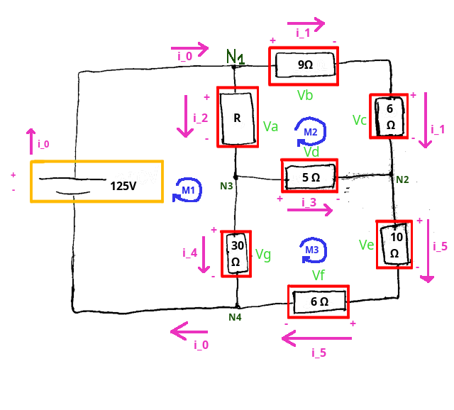

---

## Algoritmo

## Passo 9

Tendo obtido equações dos elementos dos circuitos através da LKC, da LKT e da lei de Ohm, obtemos:

$$
\begin{align}
    &i_{0} = i_{1} + i_{2} \\
    &i_{2} = i_{3} + i_{4} \\
    &i_{5} = i_{1} + i_{3} \\
    &-R \cdot i_{2} - 30 \Omega \cdot i_{4} + 125V = 0 \\
    &-9 i_{1} - 6 i_{1} + 5 i_{3} + R i_{2} = 0 \\
    &-10 i_{5} - 6 i_{5} + 30 i_{4} - 5 i_{3} = 0 \\
\end{align}
$$

$$
\begin{align}
    V_{a} &= R \cdot i_{2} \\
    V_{b} &= 9 \cdot i_{1} \\
    V_{c} &= 6 \cdot i_{1} \\
    V_{d} &= 5 \cdot i_{3} \\
    V_{e} &=10 \cdot i_{5} \\
    V_{f} &= 6 \cdot i_{5} \\
    V_{g} &=30 \cdot i_{4} \\
\end{align}
$$

---

## Algoritmo

## Passo 9

Reorganizando as equações do circuito para construir um sistema linear terminamos o algoritmo de modelagem.

$$
\begin{cases}
    &1 V_{a} + 0 V_{b} + 0 V_{c} + 0 V_{d} + 0 V_{e} + 0 V_{f} + 0 V_{g} + 0 i_{0} + 0 i_{1} - R i_{2} + 0 i_{3} + 0 i_{4} + 0 i_{5} &= 0\\
    &0 V_{a} + 1 V_{b} + 0 V_{c} + 0 V_{d} + 0 V_{e} + 0 V_{f} + 0 V_{g} + 0 i_{0} - 9 i_{1} + 0 i_{2} + 0 i_{3} + 0 i_{4} + 0 i_{5} &= 0\\
    &0 V_{a} + 0 V_{b} + 1 V_{c} + 0 V_{d} + 0 V_{e} + 0 V_{f} + 0 V_{g} + 0 i_{0} - 6 i_{1} + 0 i_{2} + 0 i_{3} + 0 i_{4} + 0 i_{5} &= 0\\
    &0 V_{a} + 0 V_{b} + 0 V_{c} + 1 V_{d} + 0 V_{e} + 0 V_{f} + 0 V_{g} + 0 i_{0} + 0 i_{1} + 0 i_{2} - 5 i_{3} + 0 i_{4} + 0 i_{5} &= 0\\
    &0 V_{a} + 0 V_{b} + 0 V_{c} + 0 V_{d} + 1 V_{e} + 0 V_{f} + 0 V_{g} + 0 i_{0} + 0 i_{1} + 0 i_{2} + 0 i_{3} + 0 i_{4} - 10 i_{5} &= 0\\
    &0 V_{a} + 0 V_{b} + 0 V_{c} + 0 V_{d} + 0 V_{e} + 1 V_{f} + 0 V_{g} + 0 i_{0} + 0 i_{1} + 0 i_{2} + 0 i_{3} + 0 i_{4} - 6 i_{5} &= 0\\
    &0 V_{a} + 0 V_{b} + 0 V_{c} + 0 V_{d} + 0 V_{e} + 0 V_{f} + 1 V_{g} + 0 i_{0} + 0 i_{1} + 0 i_{2} + 0 i_{3} - 30 i_{4} + 0 i_{5} &= 0\\
    &0 V_{a} + 0 V_{b} + 0 V_{c} + 0 V_{d} + 0 V_{e} + 0 V_{f} + 0 V_{g} + 1 i_{0} - 1 i_{1} - 1 i_{2} + 0 i_{3} + 0 i_{4} + 0 i_{5} &= 0\\
    &0 V_{a} + 0 V_{b} + 0 V_{c} + 0 V_{d} + 0 V_{e} + 0 V_{f} + 0 V_{g} + 0 i_{0} + 0 i_{1} + 1 i_{2} - 1 i_{3} - 1 i_{4} + 0 i_{5} &= 0\\
    &0 V_{a} + 0 V_{b} + 0 V_{c} + 0 V_{d} + 0 V_{e} + 0 V_{f} + 0 V_{g} + 0 i_{0} - 1 i_{1} + 0 i_{2} - 1 i_{3} + 0 i_{4} + 1 i_{5} &= 0\\
    &0 V_{a} + 0 V_{b} + 0 V_{c} + 0 V_{d} + 0 V_{e} + 0 V_{f} + 0 V_{g} + 0 i_{0} + 0 i_{1} - R i_{2} + 0 i_{3} - 30 i_{4} + 0 i_{5} &= -125\\
    &0 V_{a} + 0 V_{b} + 0 V_{c} + 0 V_{d} + 0 V_{e} + 0 V_{f} + 0 V_{g} + 0 i_{0} - 15 i_{1} + R i_{2} + 5 i_{3} + 0 i_{4} + 0 i_{5} &= 0\\
    &0 V_{a} + 0 V_{b} + 0 V_{c} + 0 V_{d} + 0 V_{e} + 0 V_{f} + 0 V_{g} + 0 i_{0} + 0 i_{1} + 0 i_{2} - 5 i_{3} + 30 i_{4} - 16 i_{5} &= 0\\
\end{cases}
$$

---

## Resolução do Circuito

Agora, devemos reescrever o sistema em sua representação matricial e usar um sistema computacional de álgebra linear simbólica (sympy do python) para nos auxiliar a resolver esse circuito e encontrar as correntes em função do resistor $R$ desconhecido:

$$
\begin{equation*}
\begin{bmatrix}
1 & 0 & 0 & 0 & 0 & 0 & 0 & 0  & 0   & -R & 0   & 0   & 0   \\
0 & 1 & 0 & 0 & 0 & 0 & 0 & 0  & -9  & 0  & 0   & 0   & 0   \\
0 & 0 & 1 & 0 & 0 & 0 & 0 & 0  & -6  & 0  & 0   & 0   & 0   \\
0 & 0 & 0 & 1 & 0 & 0 & 0 & 0  & 0   & 0  & -5  & 0   & 0   \\
0 & 0 & 0 & 0 & 1 & 0 & 0 & 0  & 0   & 0  & 0   & 0   & -10 \\
0 & 0 & 0 & 0 & 0 & 1 & 0 & 0  & 0   & 0  & 0   & 0   & -6  \\
0 & 0 & 0 & 0 & 0 & 0 & 1 & 0  & 0   & 0  & 0   & -30 & 0   \\
0 & 0 & 0 & 0 & 0 & 0 & 0 & 1  & -1  & -1 & 0   & 0   & 0   \\
0 & 0 & 0 & 0 & 0 & 0 & 0 & 0  & 0   & 1  & -1  & -1  & 0   \\
0 & 0 & 0 & 0 & 0 & 0 & 0 & 0  & -1  & 0  & -1  & 0   & 1   \\
0 & 0 & 0 & 0 & 0 & 0 & 0 & 0  & 0   & -R & 0   & -30 & 0   \\
0 & 0 & 0 & 0 & 0 & 0 & 0 & 0  & -15 & R  & 5   & 0   & 0   \\
0 & 0 & 0 & 0 & 0 & 0 & 0 & 0  & 0   & 0  & -5  & 30  & -16 \\
\end{bmatrix}
\begin{bmatrix}
V_a \\ V_b \\ V_c \\ V_d \\ V_e \\ V_f \\ V_g \\ i_0 \\ i_1 \\ i_2 \\ i_3 \\ i_4 \\ i_5
\end{bmatrix}
=
\begin{bmatrix}
0 \\ 0 \\ 0 \\ 0 \\ 0 \\ 0 \\ 0 \\ 0 \\ 0 \\ 0 \\ -125 \\ 0 \\ 0
\end{bmatrix}
\end{equation*}
$$

---

## Resolução do Circuito

Para resolver o circuito no sympy construímos uma matriz extendida composta pela matriz $A$ de coeficientes do sistema acrescida da matriz $B$ de termos independentes dele (o lado direito das equações do sistema).

$$
\begin{bmatrix}
    1 & 0 & 0 & 0 & 0 & 0 & 0 & 0 & 0 & -R & 0 & 0 & 0 & 0 \\
    0 & 1 & 0 & 0 & 0 & 0 & 0 & 0 & -9 & 0 & 0 & 0 & 0 & 0 \\
    0 & 0 & 1 & 0 & 0 & 0 & 0 & 0 & -6 & 0 & 0 & 0 & 0 & 0 \\
    0 & 0 & 0 & 1 & 0 & 0 & 0 & 0 & 0 & 0 & -5 & 0 & 0 & 0 \\
    0 & 0 & 0 & 0 & 1 & 0 & 0 & 0 & 0 & 0 & 0 & 0 & -10 & 0 \\
    0 & 0 & 0 & 0 & 0 & 1 & 0 & 0 & 0 & 0 & 0 & 0 & -6 & 0 \\
    0 & 0 & 0 & 0 & 0 & 0 & 1 & 0 & 0 & 0 & 0 & -30 & 0 & 0 \\
    0 & 0 & 0 & 0 & 0 & 0 & 0 & 1 & -1 & -1 & 0 & 0 & 0 & 0 \\
    0 & 0 & 0 & 0 & 0 & 0 & 0 & 0 & 0 & 1 & -1 & -1 & 0 & 0 \\
    0 & 0 & 0 & 0 & 0 & 0 & 0 & 0 & -1 & 0 & -1 & 0 & 1 & 0 \\
    0 & 0 & 0 & 0 & 0 & 0 & 0 & 0 & 0 & -R & 0 & -30 & 0 & -125 \\
    0 & 0 & 0 & 0 & 0 & 0 & 0 & 0 & -15 & R & 5 & 0 & 0 & 0 \\
    0 & 0 & 0 & 0 & 0 & 0 & 0 & 0 & 0 & 0 & -5 & 30 & -16 & 0
\end{bmatrix}
$$

---

## Resolução do Circuito No JupyterLite pelo SymPy

<iframe src="https://diegoascanio.github.io/jupyterlite/lab?path=kirchoff.ipynb" width=100% height=100%></iframe>

---

## Resolução do Circuito

Todas as correntes do circuito em função do resistor $R$ dadas pelo sympy são:

$$

\displaystyle \left[\begin{array}{cccccccccccccc}1 & 0 & 0 & 0 & 0 & 0 & 0 & 0 & 0 & 0 & 0 & 0 & 0 & \frac{4225 R}{53 R + 474}\\0 & 1 & 0 & 0 & 0 & 0 & 0 & 0 & 0 & 0 & 0 & 0 & 0 & \frac{2295 R + 6750}{53 R + 474}\\0 & 0 & 1 & 0 & 0 & 0 & 0 & 0 & 0 & 0 & 0 & 0 & 0 & \frac{1530 R + 4500}{53 R + 474}\\0 & 0 & 0 & 1 & 0 & 0 & 0 & 0 & 0 & 0 & 0 & 0 & 0 & \frac{11250 - 400 R}{53 R + 474}\\0 & 0 & 0 & 0 & 1 & 0 & 0 & 0 & 0 & 0 & 0 & 0 & 0 & \frac{1750 R + 30000}{53 R + 474}\\0 & 0 & 0 & 0 & 0 & 1 & 0 & 0 & 0 & 0 & 0 & 0 & 0 & \frac{1050 R + 18000}{53 R + 474}\\0 & 0 & 0 & 0 & 0 & 0 & 1 & 0 & 0 & 0 & 0 & 0 & 0 & \frac{2400 R + 59250}{53 R + 474}\\0 & 0 & 0 & 0 & 0 & 0 & 0 & 1 & 0 & 0 & 0 & 0 & 0 & \frac{255 R + 4975}{53 R + 474}\\0 & 0 & 0 & 0 & 0 & 0 & 0 & 0 & 1 & 0 & 0 & 0 & 0 & \frac{255 R + 750}{53 R + 474}\\0 & 0 & 0 & 0 & 0 & 0 & 0 & 0 & 0 & 1 & 0 & 0 & 0 & \frac{4225}{53 R + 474}\\0 & 0 & 0 & 0 & 0 & 0 & 0 & 0 & 0 & 0 & 1 & 0 & 0 & \frac{2250 - 80 R}{53 R + 474}\\0 & 0 & 0 & 0 & 0 & 0 & 0 & 0 & 0 & 0 & 0 & 1 & 0 & \frac{80 R + 1975}{53 R + 474}\\0 & 0 & 0 & 0 & 0 & 0 & 0 & 0 & 0 & 0 & 0 & 0 & 1 & \frac{175 R + 3000}{53 R + 474}\end{array}\right]

$$

Sabemos que $i_{1} = {{255R + 750} \over {53R + 474}}$ (linha 8 da matriz). Sabemos também que $i_{1} = 3A$.

Resolvendo esta equação igual à $3A$ no sympy, obtemos $R = 7 \Omega$.

Substituindo $R$ por $7 \Omega$ em todas as outras equações dos elementos obtemos:

$$
\begin{align}
    V_a = 35\\
    V_b = 27\\
    V_c = 18\\
    V_d = 10\\
    V_e = 50\\
    V_f = 30\\
    V_g = 90
\end{align}
$$

$$
\begin{align}
    i_0 = 8\\
    i_1 = 3\\
    i_2 = 5\\
    i_3 = 2\\
    i_4 = 3\\
    i_5 = 5\\
\end{align}
$$

Portanto, agora o circuito está resolvido, pois, é possível calcular todas as grandezas elétricas associadas a seus elementos.

---

# Como resolver circuitos que tenham fontes de tensão e fontes de correntes?

---

## Circuito com Fonte de Tensão e Fonte de Corrente

Como descobrir a corrente fornecida pela fonte de corrente do circuito quando a corrente que passa no resistor de $12 \Omega$ (conectado ao polo negativo da fonte de tensão de $80V$) é de $4A$ entrando pela esquerda e saindo à direita do resistor?

- Aplicando o algoritmo!

<!-- _class: transparent -->

---

## Circuito com Fonte de Tensão e Fonte de Corrente

### Passo 1

Determine quais são os elementos (resistores e fontes) do circuito e identifique-os;

<!-- _class: transparent -->
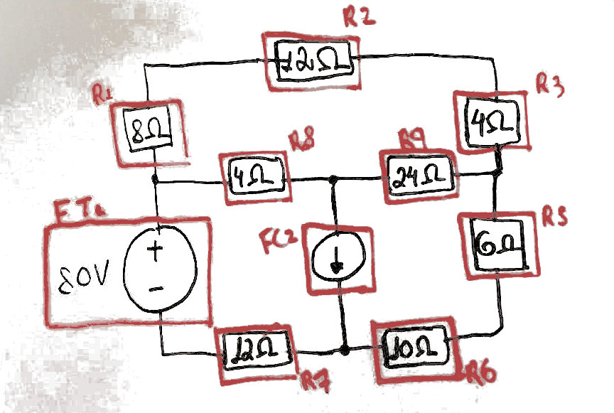

---

## Circuito com Fonte de Tensão e Fonte de Corrente

### Passo 2

Atribua uma corrente (arbitrando sua direção) em cada elemento. Elementos no mesmo ramo (em série entre dois nós) devem ser atribuídos à mesma corrente. Não se esqueça de atribuir correntes às fontes de tensão.

**MUITO, MUITO, MUITO IMPORTANTE:**

Sabemos, pelo enunciado do problema, que a corrente $i_{0}$ vale $4A$ quando entra pela esquerda e sai a direita do resistor de $12 \Omega$.

1. É possível arbitrar qualquer sentido de circulação da corrente! 
2. Arbitramos, para melhorar nossa visualização do circuito, que a corrente $i_{0}$ entra da direita para a esquerda no resistor $R_{7}$ (e na fonte).
    1. Como isso é contrário ao previamente estabelecido, então, a corrente $i_{0}$ no sentido de entrada da direita para a esquerda vale o simétrico (o contrário: $-4A$) do sentido da esquerda para a direita. Desta forma, porque arbitrei $i_{0}$ entrando da direita para a esquerda, mas, sabendo que $i_{0}$ entra originalmente da esquerda para a direita em $R_{7}$, então, quando eu for formular as equações, devo considerar o valor de $i_{0}$ como $-4A$!

<!-- _class: transparent -->
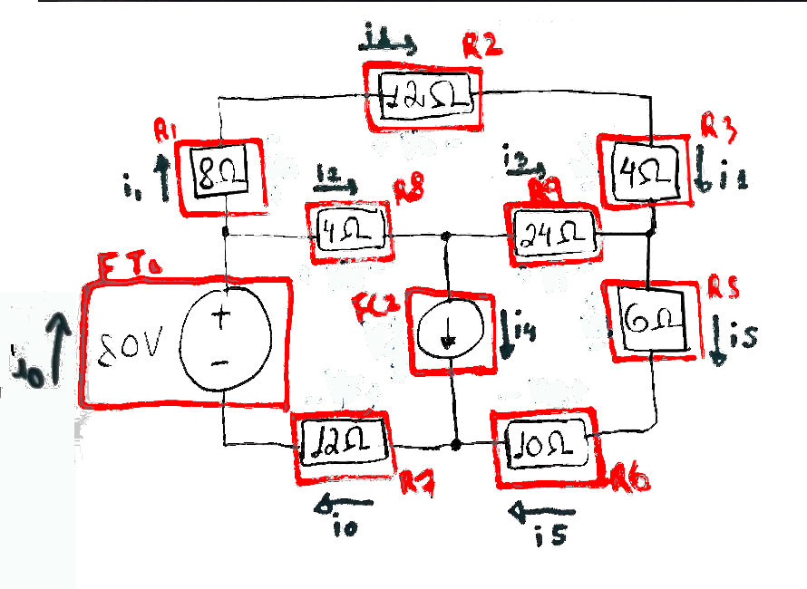

---

## Circuito com Fonte de Tensão e Fonte de Corrente

### Passo 3

Atribua uma tensão a cada elemento. Se for um resistor, indutor ou capacitor, o sinal + deve ser colocado onde a corrente entra no elemento. Não se esqueça de atribuir tensões às fontes de correntes (se existirem).

<!-- _class: transparent -->
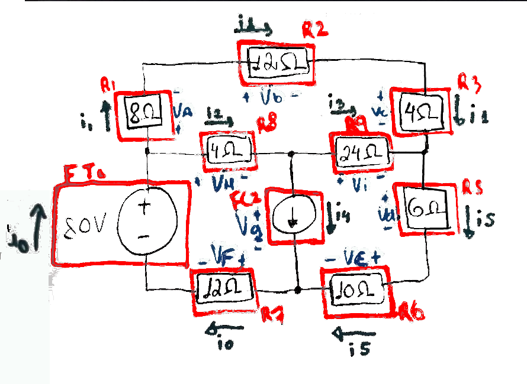

---

## Circuito com Fonte de Tensão e Fonte de Corrente

### Passo 4

Determine quais são os nós essenciais do circuito (ponto onde três ou mais elementos se juntam).

No nosso circuito são os nós $N_{\alpha}, N_{\beta}, N_{\gamma} \text{ e } N_{\delta}$

<!-- _class: transparent -->

---

## Circuito com Fonte de Tensão e Fonte de Corrente

### Passo 5

Determine quais são as malhas (Caminhos (laços) cujos nó inicial e final se coincidem sem englobar nenhum outro laço) do circuito.

No nosso circuito são as malhas $M_{1}, M_{2} \text{ e } M_{3}$

<!-- _class: transparent -->
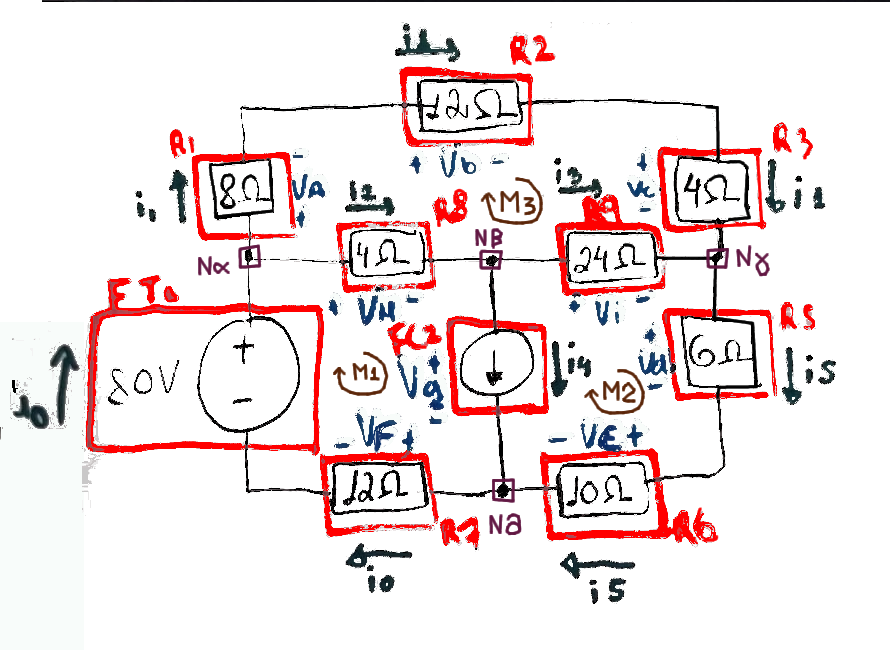

---

## Circuito com Fonte de Tensão e Fonte de Corrente

### Passo 6

Levando em conta a lei de Kirchhoff da corrente, que afirma que a soma das correntes entrando em um nó é igual àquelas que saem, identifique o comportamento das correntes nos nós:

- Em $N_{\alpha}$: $i_{0} = i_{1} + i_{2}$
- Em $N_{\beta}$: $i_{2} = i_{3} + i_{4}$
- Em $N_{\gamma}$: $i_{5} = i_{1} + i_{3}$
- Em $N_{\delta}$: $i_{0} = i_{4} + i_{5}$

Como um dos nós é combinação linear dos demais, escolhemos arbitrariamente $N_{\delta}$ para ser desprezado na montagem das equações de resolução do circuito.

<!-- _class: transparent -->

---

## Circuito com Fonte de Tensão e Fonte de Corrente

### Passo 7

Escreva as diferenças de potencial existentes em uma malha levando em consideração a lei de kirchoff da tensão, que estabelece que a soma das diferenças de potencial dos elementos de uma malha é igual a zero.

Aqui a sinalização dos pontos onde ocorrem quedas de pontecial nos resistores será essencial, pois:

- Se em um ponto da malha, o caminho da malha se mover de um ponto de menor tensão (-) para um ponto de maior tensão (+) em um resistor, você deve considerar um aumento de tensão nesse caminho. 

- Se o caminho se mover de um ponto de maior tensão para um ponto de menor tensão, você deve considerar um decréscimo de tensão no caminho da malha.

Em $M_{1}$: $80 - 4 \cdot i_{2} - V_{g} - 12 \cdot i_{0} = 0$
Em $M_{2}$: $-24 \cdot i_{3} - 16 \cdot i_{5} + V_{g} = 0$
Em $M_{3}$: $-24 \cdot i_{1} + 24 \cdot i_{3} + 4 \cdot i_{2} = 0$

<!-- _class: transparent -->

---

## Circuito com Fonte de Tensão e Fonte de Corrente

### Passo 8

Escreva equações da lei de Ohm (V = Ri) para cada resistor do circuito.

$$
\begin{align}
    V_{R_{1}} &= V_{a} = 8 \cdot i_{1} \\
    V_{R_{2}} &= V_{b} = 12 \cdot i_{1} \\
    V_{R_{3}} &= V_{c} = 4 \cdot i_{1} \\
    V_{R_{4}} &= V_{i} = 24 \cdot i_{3} \\
\end{align}
$$

$$
\begin{align}
    V_{R_{5}} &= V_{d} = 6 \cdot i_{5} \\
    V_{R_{6}} &= V_{e} = 10 \cdot i_{5} \\
    V_{R_{7}} &= V_{f} = 12 \cdot i_{0} \\
    V_{R_{8}} &= V_{h} = 4 \cdot i_{2} \\
\end{align}
$$

<!-- _class: transparent -->

---

## Circuito com Fonte de Tensão e Fonte de Corrente

### Passo 9

A partir das equações de corrente obtidas em 6, 7 e 8, se você seguiu o método corretamente, você produziu um modelo matemático adequado para o comportamento de circuito e ele pode ser resolvido através de sistemas lineares. IMPORTANTE: o número de equações obtidas deve ser igual ao número de incógnitas (valores desconhecidos) que representam os elementos do circuito.

#### Equações

Como $i_{0} = 4A$ da esquerda para direita, mas, estamos considerando seu sentido da direita para esquerda, então, para fins de resolução, consideramos $i_{0}$ como $-4A$ na LKC e na LKT, pois, não faz diferença na lei de Ohm (Ver [Slide 41](#41))

$$
\begin{align}
&V_{a} - 8 i_{1} &= &0 \\
&V_{b} - 12 i_{1} &= &0 \\
&V_{c} - 4 i_{1} &= &0 \\
&V_{d} - 6 i_{5} &= &0 \\
&V_{e} - 10 i_{5} &= &0 \\
&V_{f} &= &48^{1} \\
&V_{h} - 4 i_{2} &= &0
\end{align}
$$

$$
\begin{align}
&V_{i} - 24 i_{3} &= 0 \\
&i_{1} + i_{2} &= -4 \\
&i_{2} - i_{3} - i_{4} &= 0 \\
&i_{5} - i_{1} - i_{3} &= 0 \\
& 80 -4 i_{2} - V_{g} - (12 \cdot -4) &= 0 \rightarrow \\
& \therefore -4 i_{2} - V_{g} &= -128 \\
& -24 i_{3} - 16 i_{5} + V_{g} &= 0 \\
& -24 i_{1} + 24 i_{3} + 4 i_{2} &= 0
\end{align}
$$

<!-- _class: transparent -->

14 variáveis desconhecidas: $[V_{a}, V_{b}, V_{c}, V_{d}, V_{e}, V_{f}, V_{g}, V_{h}, V_{i}, i_{1}, i_{2}, i_{3}, i_{4}, i_{5}]$ e 14 equações para estas variáveis, logo, é possível resolver este circuito através de um sistema linear.

---

## Circuito com Fonte de Tensão e Fonte de Corrente

### Passo 9

Reorganizando as equações do circuito para construir um sistema linear terminamos o algoritmo de modelagem nos seguintes termos:

$$
\begin{cases}
    &1 V_{a} + 0 V_{b} + 0 V_{c} + 0 V_{d} + 0 V_{e} + 0 V_{f} + 0 V_{g} + 0 V_{h} + 0 V_{i} - 8 i_{1} + 0 i_{2} + 0 i_{3} + 0 i_{4} + 0 i_{5} &= 0\\
    &0 V_{a} + 1 V_{b} + 0 V_{c} + 0 V_{d} + 0 V_{e} + 0 V_{f} + 0 V_{g} + 0 V_{h} + 0 V_{i} -12 i_{1} + 0 i_{2} + 0 i_{3} + 0 i_{4} + 0 i_{5} &= 0\\
    &0 V_{a} + 0 V_{b} + 1 V_{c} + 0 V_{d} + 0 V_{e} + 0 V_{f} + 0 V_{g} + 0 V_{h} + 0 V_{i} - 4 i_{1} + 0 i_{2} + 0 i_{3} + 0 i_{4} + 0 i_{5} &= 0\\
    &0 V_{a} + 0 V_{b} + 0 V_{c} + 1 V_{d} + 0 V_{e} + 0 V_{f} + 0 V_{g} + 0 V_{h} + 0 V_{i} + 0 i_{1} + 0 i_{2} + 0 i_{3} + 0 i_{4} - 6 i_{5} &= 0\\
    &0 V_{a} + 0 V_{b} + 0 V_{c} + 0 V_{d} + 1 V_{e} + 0 V_{f} + 0 V_{g} + 0 V_{h} + 0 V_{i} + 0 i_{1} + 0 i_{2} + 0 i_{3} + 0 i_{4} - 10 i_{5} &= 0\\
    &0 V_{a} + 0 V_{b} + 0 V_{c} + 0 V_{d} + 0 V_{e} + 1 V_{f} + 0 V_{g} + 0 V_{h} + 0 V_{i} + 0 i_{1} + 0 i_{2} + 0 i_{3} + 0 i_{4} + 0 i_{5} &= 48\\
    &0 V_{a} + 0 V_{b} + 0 V_{c} + 0 V_{d} + 0 V_{e} + 0 V_{f} + 0 V_{g} + 1 V_{h} + 0 V_{i} + 0 i_{1} - 4 i_{2} + 0 i_{3} + 0 i_{4} + 0 i_{5} &= 0\\
    &0 V_{a} + 0 V_{b} + 0 V_{c} + 0 V_{d} + 0 V_{e} + 0 V_{f} + 0 V_{g} + 0 V_{h} + 1 V_{i} + 0 i_{1} + 0 i_{2} -24 i_{3} + 0 i_{4} + 0 i_{5} &= 0\\
    &0 V_{a} + 0 V_{b} + 0 V_{c} + 0 V_{d} + 0 V_{e} + 0 V_{f} + 0 V_{g} + 0 V_{h} + 0 V_{i} + 1 i_{1} + 1 i_{2} + 0 i_{3} + 0 i_{4} + 0 i_{5} &= -4\\
    &0 V_{a} + 0 V_{b} + 0 V_{c} + 0 V_{d} + 0 V_{e} + 0 V_{f} + 0 V_{g} + 0 V_{h} + 0 V_{i} + 0 i_{1} + 1 i_{2} - 1 i_{3} - 1 i_{4} + 0 i_{5} &= 0\\
    &0 V_{a} + 0 V_{b} + 0 V_{c} + 0 V_{d} + 0 V_{e} + 0 V_{f} + 0 V_{g} + 0 V_{h} + 0 V_{i} - 1 i_{1} + 0 i_{2} - 1 i_{3} + 0 i_{4} + 1 i_{5} &= 0\\
    &0 V_{a} + 0 V_{b} + 0 V_{c} + 0 V_{d} + 0 V_{e} + 0 V_{f} - 1 V_{g} + 0 V_{h} + 0 V_{i} + 0 i_{1} - 4 i_{2} + 0 i_{3} + 0 i_{4} + 0 i_{5} &= -128\\
    &0 V_{a} + 0 V_{b} + 0 V_{c} + 0 V_{d} + 0 V_{e} + 0 V_{f} + 1 V_{g} + 0 V_{h} + 0 V_{i} + 0 i_{1} + 0 i_{2} - 24 i_{3} + 0 i_{4} - 16 i_{5} &= 0\\
    &0 V_{a} + 0 V_{b} + 0 V_{c} + 0 V_{d} + 0 V_{e} + 0 V_{f} + 0 V_{g} + 0 V_{h} + 0 V_{i} - 24 i_{1} + 4 i_{2} + 24 i_{3} + 0 i_{4} + 0 i_{5} &= 0\\
\end{cases}
$$

---

## Resolução do Circuito

Agora, devemos reescrever o sistema em sua representação matricial e usar um sistema computacional de álgebra linear numérica(numpy do python) para nos auxiliar a resolver esse circuito:

<!-- 
a & b & c & d & e & f & g & h  & i   & 1  & 2   & 3   & 4   & 5  \\
-->

$$
\begin{equation*}
\begin{bmatrix}
1 & 0 & 0 & 0 & 0 & 0 & 0 & 0  & 0   & -8 & 0   & 0   & 0   & 0  \\
0 & 1 & 0 & 0 & 0 & 0 & 0 & 0  & 0   & -12& 0   & 0   & 0   & 0  \\
0 & 0 & 1 & 0 & 0 & 0 & 0 & 0  & 0   & -4 & 0   & 0   & 0   & 0  \\
0 & 0 & 0 & 1 & 0 & 0 & 0 & 0  & 0   & 0  & 0   & 0   & 0   & -6 \\
0 & 0 & 0 & 0 & 1 & 0 & 0 & 0  & 0   & 0  & 0   & 0   & 0   & -10\\
0 & 0 & 0 & 0 & 0 & 1 & 0 & 0  & 0   & 0  & 0   & 0   & 0   & 0  \\
0 & 0 & 0 & 0 & 0 & 0 & 0 & 1  & 0   & 0  & -4  & 0   & 0   & 0  \\
0 & 0 & 0 & 0 & 0 & 0 & 0 & 0  & 1   & 0  & 0   & -24 & 0   & 0  \\
0 & 0 & 0 & 0 & 0 & 0 & 0 & 0  & 0   & 1  & 1   & 0   & 0   & 0  \\
0 & 0 & 0 & 0 & 0 & 0 & 0 & 0  & 0   & 0  & 1   & -1  & -1  & 0  \\
0 & 0 & 0 & 0 & 0 & 0 & 0 & 0  & 0   & -1 & 0   & -1  & 0   & 1  \\
0 & 0 & 0 & 0 & 0 & 0 & -1& 0  & 0   & 0  & -4  & 0   & 0   & 0  \\
0 & 0 & 0 & 0 & 0 & 0 & 1 & 0  & 0   & 0  & 0   & -24 & 0   & -16\\
0 & 0 & 0 & 0 & 0 & 0 & 0 & 0  & 0   & -24& 4   & 24  & 0   & 0  \\
\end{bmatrix}
\begin{bmatrix}
V_a \\ V_b \\ V_c \\ V_d \\ V_e \\ V_f \\ V_g \\ V_h \\ V_i \\ i_1 \\ i_2 \\ i_3 \\ i_4 \\ i_5
\end{bmatrix}
=
\begin{bmatrix}
0 \\ 0 \\ 0 \\ 0 \\ 0 \\ 48\\ 0 \\ 0 \\ -4 \\ 0 \\ 0 \\ -128 \\ 0 \\ 0
\end{bmatrix}
\end{equation*}
$$

---

## Resolução do Circuito No JupyterLite pelo SymPy

<iframe src="https://diegoascanio.github.io/jupyterlite/lab?path=exemplo-2.ipynb" width=100% height=100%></iframe>

---

## Resolução do Circuito

Resolvendo o sistema linear do circuito obtemos:

$$
\begin{align}
    &V_a = 16.00V\\
    &V_b = 24.00V\\
    &V_c = 8.00V\\
    &V_d = 30.00V\\
    &V_e = 50.00V\\
    &V_f = 48.00V\\
    &V_g = 152.00V\\
    &V_h = -24.00V\\
    &V_i = 72.00V\\
\end{align}
$$

$$
\begin{align}
    &i_1 = 2.00A\\
    &i_2 = -6.00A\\
    &i_3 = 3.00A\\
    &i_4 = -9.00A\\
    &i_5 = 5.00A\\
\end{align}
$$

Logo, a corrente $i_{4}$ gerada pela fonte de corrente é de $-9 A$.

---

<!-- _class: lead -->

# Método das Tensões dos Nós

---

## Método das Tensões dos Nós

É um método para análise (e solução) de circuitos elétricos que busca a descoberta de grandezas desconhecidas dos elementos (ex. correntes e tensões) à partir das tensões existentes entre nós (pontos de encontro de dois ou mais elementos) de um circuito elétrico.

É desejável porque simplifica a solução de circuitos — em comparação às leis de kirchoff da corrente nos nós e da tensão nas malhas — ao permitir que a lei de kirchoff das correntes nos nós seja escrita em função das tensões que estes nós apresentam em relação a um nó de referência.

Um nó de referência é um ponto de partida — normalmente o nó com a maior quantidade de elementos — conectado ao referencial nulo (terra) através do qual pode-se calcular as diferenças de potencial em relação aos demais nós do circuito a partir das quedas (ou subidas) de tensão ocasionadas pelos elementos existentes entre o nó de referência e nó que se deseja descobrir a tensão.

<figure>

<figcaption>Figura 1 - Exemplo de Nó de Referência.
</figcaption>
</figure>

---

## Método das tensões dos nós

<figure>

<figcaption>Figura 2 - Elemento de Exemplo</figcaption>
</figure>

O que torna o método dos nós possível? A lei de ohm, que diz que a corrente de um elemento é dada pela razão da diferença de potencial a qual está submetida sobre sua resistência. 

Essa diferença de potencial V é sempre dada pela tensão em um ponto A (\\(V\_A\\)) menos a tensão de um ponto B (\\(V\_B\\)) — \\(V = V\_A - V\_B\\). Logo, para o elemento de exemplo da Figura 2:

\\[ i = {{V\_A - V\_B}\over{R}} \\]

Generalizando isto para todos os elementos de um circuito que convergem em um nó qualquer, conseguimos escrever a lei de kirchhoff das correntes para um nó em função das tensões dos elementos que convergem nele!

Ao permitir analisar correntes em funções das tensões dos nós, as equações da lei de kirchoff da tensão ficam implicitas no método das tensões dos nós e portanto, são eliminadas das análises, diminuindo o número de equações e consequentemente, simplificando o sistema, demonstrando assim a sua desejabilidade!

---

## Método da Tensão nos Nós — Exemplo e Algoritmo

O cerne do método das tensões dos nós está em encontrar as diferenças de potencial nos nós de um circuito em relação ao nó de referência e a partir destas tensões, especificar as correntes que transitam pelos nós do circuito em função de tal tensão. Portanto, o método pode ser sistematizado em 6 passos:

1. Identificar todos os nós do circuito atribuindo nomes (letras latinas, gregas, etc) a cada um deles;
2. Escolher um nó de referência;
    - Uma boa escolha de nó de referência é aquele que permite calcular de imediato a tensão nodal de outro nó — exemplo, um nó que esteja ligado ao terminal de uma fonte de tensão — ou na ausência de tal nó, um nó que esteja ligado ao maior número de elementos possíveis do circuito;
        - Escolher um nó de referência que permita encontrar de imediato a tensão nodal de outro(s) nó(s) reduz o número de equações a serem resolvidas;
3. Atribuir tensões a todos os outros nós em relação ao nó de referência;
    - Se forem nós cujos caminhos ao nó de referência possuam apenas fontes de tensão, a tensão é conhecida e deve ser atribuída como tensão do nó o valor da(s) fonte(s) de tensão conhecidas;
    - Senão, atribuir uma variável de tensão ao nó — exemplo: \\(V\_k\\) para o nó de nome \\(k\\);

---

## Método da Tensão nos Nós — Exemplo e Algoritmo

O cerne do método das tensões dos nós está em encontrar as diferenças de potencial nos nós de um circuito em relação ao nó de referência e a partir destas tensões, especificar as correntes que transitam pelos nós do circuito em função de tal tensão. Portanto, o método pode ser sistematizado em 6 passos:

4. Atribuir correntes (sentidos arbitrários) para todos os elementos do circuito (fontes e resistores, por hora) e quando possível, escrever tais correntes em função das tensões que entram e que saem destes elementos (apenas nos resistores no caso) a partir da lei de Ohm que especifica que:

\\[
    i_\text{ab} = \frac{v_\text{ab}}{R} = \frac{v_\text{a} - v_\text{b}}{R}
\\]

5. Para cada um dos nós cujas tensões sejam desconhecidas:
    - Escrever a LKC para o nó em questão, considerando as correntes que entram e que saem do nó em função das tensões nodais desconhecidas, quando aplicável, e em função das correntes oriundas de fontes de corrente e das correntes oriundas de fontes de tensão, também quando aplicável.
6. Construir um sistema de equações lineares a partir das equações de LKC escritas para cada nó desconhecido e resolver tal sistema para encontrar as tensões nodais desconhecidas, resolvendo desta forma o circuito.

---

## Método das Tensões dos Nós - Circuito de Exemplo

<!-- _class: transparent -->

---

## Método das Tensões dos Nós - Passo 1 - Identificação dos Nós

Passo 1 - Identificação dos nós

Nós identificados:

1. α
2. β
3. γ
4. δ

<!-- _class: transparent -->
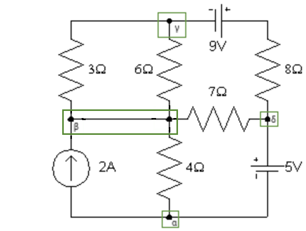

---

## Método das Tensões dos Nós - Passo 2 - Escolha do Nó de Referência

Passo 2 - Escolha do nó de referência

Escolhemos como nó de referência o nó α por ele permitir deduzir de imediato a tensão nodal do nó δ — \\(V_\delta = 5V\\) — elminando desta forma duas equações de dois nós (o de referência, tensão \\(0V\\), e o nó δ com tensão \\(V_\delta = 5V\\)) do sistema de equações a resolver.

<!-- _class: transparent -->
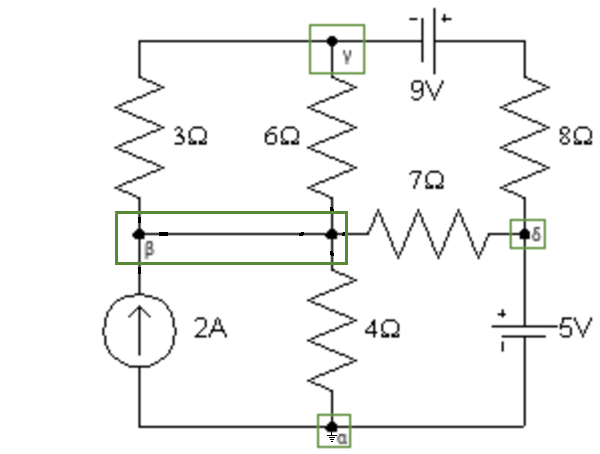

---

## Método das Tensões dos Nós - Passo 3 - Atribuição de Tensões a Todos os Nós em Relação ao nó de referência.

3. Atribuir tensões a todos os outros nós em relação ao nó de referência;
    - Se forem nós cujos caminhos ao nó de referência possuam apenas fontes de tensão, a tensão é conhecida e deve ser atribuída como tensão do nó o valor da(s) fonte(s) de tensão conhecidas;
    - Senão, atribuir uma variável de tensão ao nó — exemplo: \\(V\_k\\) para o nó de nome \\(k\\).

O nó de referência está sempre conectado ao terra e portanto, sua tensão é sempre \\(V_\alpha = 0V\\).

No nosso exemplo, apenas um nó possui caminho com apenas fonte(s) de tensão, o nó δ que está conectado ao nó α por uma fonte de tensão de 5V. 

Saindo de α até δ temos que: \\(V_\alpha + 5 = V_\delta \implies 0 + 5 = V_\delta \therefore V_\delta = 5V \\)

Os outros dois nós, β e γ, têm tensões desconhecidas, portanto atribuo a eles as tensões \\(V_\beta\\) e \\(V_\gamma\\), respectivamente. Logo, todas as tensões de nó são:

- Nó α: \\(V_\alpha = 0V\\)
- Nó β: \\(V_\beta\\)
- Nó γ: \\(V_\gamma\\)
- Nó δ: \\(V_\delta = 5V\\)

<!-- _class: transparent -->

---

## Método das Tensões dos Nós - Passo 4

4. Atribuir correntes (sentidos arbitrários) para todos os elementos do circuito (fontes e resistores, por hora) e quando possível, escrever tais correntes em função das tensões que entram e que saem destes elementos (apenas nos resistores no caso) a partir da lei de Ohm que especifica que \\(i\_{ab} = \frac{v\_{ab}}{R\_{ab}} = \frac{V\_a - V\_b}{R\_{ab}} \\).

Correntes atribuídas, seus sentidos e sua forma em função das tensões de nós, quando possível:

|   Corrente   |              Sentido              |                        Forma em função das tensões de nós                        |
| :----------: | :-------------------------------: | :--------------------------------------------------------------------------------------: |
|   \\(I\\)    | \\( \alpha \rightarrow \delta \\) |                                      Não é possível                                      |
| \\(i\_{1}\\) | \\( \alpha \rightarrow \beta \\)  | \\(i\_{1} = \frac{V\_{\alpha} - V\_{\beta}}{4 \Omega} = \frac{- V\_{\beta}}{4 \Omega}\\) |
| \\(i\_{2}\\) | \\( \beta \rightarrow \gamma \\)  |                 \\(i\_{2} = \frac{V\_{\beta} - V\_{\gamma}}{3 \Omega}\\)                 |

|   Corrente   |              Sentido              |                              Forma em função das tensões de nós                               |
| :----------: | :-------------------------------: | :---------------------------------------------------------------------------------------------------: |
| \\(i\_{3}\\) | \\( \gamma \rightarrow \beta \\)  |                       \\(i\_{3} = \frac{V\_{\gamma} - V\_{\beta}}{6 \Omega}\\)                        |
| \\(i\_{4}\\) | \\( \delta \rightarrow \beta \\)  |      \\(i\_{4} = \frac{V\_{\delta} - V\_{\beta}}{7 \Omega} = \frac{5 - V\_{\beta}}{7 \Omega} \\)      |
| \\(i\_{5}\\) | \\( \gamma \rightarrow \delta \\) | \\(i\_{5} = \frac{V\_{\gamma} + 9 - V\_{\delta}}{8 \Omega} \therefore \\)   \\( i\_{5} = \frac{V\_{\gamma} + 9 - 5}{8 \Omega} = \frac{V\_{\gamma} + 4}{8 \Omega} \\) |

<!-- _class: transparent -->

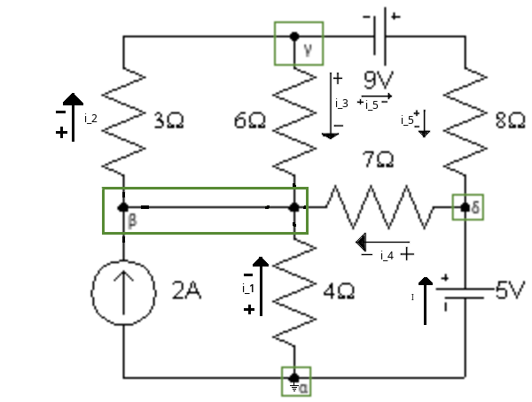

---

## Método das Tensões dos Nós - Passo 5

Para cada um dos nós cujas tensões sejam desconhecidas:

-   Escrever a LKC para o nó em questão, considerando as correntes que entram e que saem do nó em função das tensões nodais desconhecidas, quando aplicável, e em função das correntes oriundas de fontes de corrente e das correntes oriundas de fontes de tensão, também quando aplicável. No caso, temos os nós β e γ com tensões desconhecidas.

| Nó  |           Correntes que entram         | Correntes que saem | LKC com correntes em função das tensões nodais (Quando Aplicável) |
| :-: | :------------------------------------: | :----------------: | :-----------------------------------------------------------------------: |
|  β  | \\( 2A, i\_1, i\_3 \text{ e } i\_4 \\) |   \\( i\_2 \\)     | \\( 2 - \frac{V\_{\beta}}{4} + \frac{V\_{\gamma} - V\_{\beta}}{6} + \frac{5 - V\_{\beta}}{7} = \frac{V\_{\beta} -  V\_{\gamma}}{3} \\) |
|  γ  | \\( i\_2 \\) |   \\( i\_3 \text{ e } i\_5 \\)  | \\( \frac{V\_{\beta} -  V\_{\gamma}}{3} = \frac{V\_{\gamma} - V\_{\beta}}{6} + \frac{V\_{\gamma} + 4}{8} \\) |

Vemos que apenas duas variáveis são desconhecidas, \\( V\_{\beta} \\) e \\( V\_{\gamma} \\), e que temos duas equações. Assim, podemos resolver o sistema de equações para encontrar as tensões nodais desconhecidas.

<!-- _class: transparent -->

---

<!-- _class: lead -->
## Método das Tensões dos Nós - Passo 6

<iframe src="https://diegoascanio.github.io/jupyterlite/lab?path=metodo-tensao-dos-nos.ipynb" width=100% height=100%></iframe>

---

## Método das Tensões dos Nós - Conclusões

### Vantagens

- Reduz o número de equações a serem resolvidas;
- Facilita a visualização do comportamento da estrutura;
- Elimina a necessidade de se lidar com a LKT nas malhas.

### Desvantagens

- Sobrecarga cognitiva nas operações de montagem das equações, o que facilita a ocorrência de erros de desatenção por esquecimento de termos ou sinais;
    - Porque usando LKC nos nós, LKT nas malhas e Lei de Ohm, a montagem das equações é mais simples e direta;

### Exercício

Resolva o circuito anterior pelo método tradicional e aponte a quantidade de equações que o método das tensões dos nós eliminou.

---

<!-- _class: lead -->
## Método das Tensões dos Nós - Fontes Dependentes

<iframe src="https://diegoascanio.github.io/jupyterlite/lab?path=metodo-tensao-dos-nos-fonte-dependente.ipynb" width=100% height=100%></iframe>

---

<!-- _class: lead -->

# Método das Correntes das Malhas

---

## Método das Correntes das Malhas

É um método para análise (e solução) de circuitos elétricos que busca a descoberta de grandezas desconhecidas dos elementos (ex. correntes e tensões) à partir de correntes elétricas compostas existentes em malhas — caminhos fechados que não contém outros camnhos fechados dentro de si — de um circuito elétrico.

É desejável porque simplifica a solução de circuitos — em comparação às leis de kirchoff da corrente nos nós e da tensão nas malhas — ao permitir que a lei de kirchoff das tensões nas malhas nós seja escrita em função das correntes que transistam nas malhas.

### Fundamentos

Considerando a LKT nas malhas que estabelece que a soma algébrica das diferenças de potencial elétrico em uma malha é igual a zero e a lei de Ohm que estabelece que a tensão elétrica em um resistor é igual ao produto da resistência pelo valor da corrente que o atravessa \\((V = R \cdot I)\\), conseguimos, portanto, escrever a LKT nas malhas em função das correntes que transitam nas malhas — implicitando as equações da LKC nos nós — e, assim, diminuir a quantidade de equações a serem resolvidas para solucionar o circuito.

---

## Método das Correntes das Malhas

### Algoritmo

1. Identifique as \\(M\\) malhas do circuito, enumere-as e atribua uma corrente de malha \\(i\_k | k = 1 \ldots M \\) — com sentido arbitrário — a cada uma delas;
2. Para cada resistor \\(R\\) dos \\(N\\) resistores do circuito, escreva sua corrente \\(i\_{R\_j} | j = 1 \ldots N \\) em função das correntes de malha que transitam sobre ele. Seus sentidos também são arbitrários, por isso, considere a tensão no ponto de entrada da corrente no resistor \\(i\_{R\_j}\\\) maior que a tensão no ponto de saída; Atribua um sinal de positivo no ponto da entrada da corrente e um sinal de negativo no ponto de saída;

3. Para cada malha do circuito escreva LKT considerando em cada malha:
    - As quedas (ou elevações) de tensão causadas pelo trânsito das correntes nos resistores;
    - As quedas (ou elevações) de tensão causadas pelas fontes de tensão;
    - As quedas (ou elevações) de tensão causadas pelas fontes de corrente;
4. Simplifique até quando possível as equações obtidas, construa um sistema de equações lineares e resolva-o para encontrar as grandezas incógnitas do circuito.

---

## Método das Correntes das Malhas - Exemplo

Através do método das correntes da malha, determine a potência dissipada pelo resistor de $4\Omega$.

<!-- _class: transparent -->
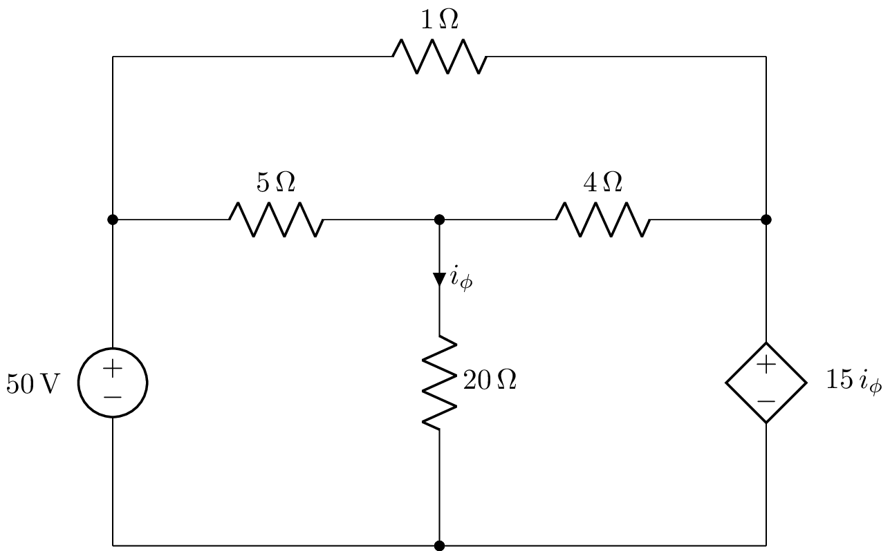

---

## Método das Correntes das Malhas - Passo 1

Através do método das correntes da malha, determine a potência dissipada pelo resistor de $4\Omega$.

1. Identifique as \\(M\\) malhas do circuito, enumere-as e atribua uma corrente de malha \\(i_k | k = 1 \ldots M \\) — com sentido arbitrário — a cada uma delas;

| Malha     | Corrente  | Sentido |
| --------- | --------- | ------- |
| \\(M_1\\) | \\(i_1\\) | Horário |
| \\(M_2\\) | \\(i_2\\) | Horário |
| \\(M_3\\) | \\(i_3\\) | Horário |

<!-- _class: transparent -->

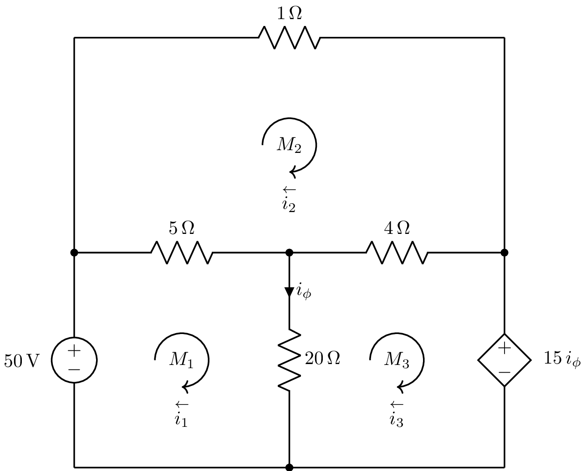

---

## Método das Correntes das Malhas - Passo 2

Através do método das correntes da malha, determine a potência dissipada pelo resistor de $4\Omega$.

2. Para cada resistor \\(R\\) dos \\(N\\) resistores do circuito, escreva sua corrente \\(i\_{R\_j} | j = 1 \ldots N \\) em função das correntes de malha que transitam sobre ele. Seus sentidos também são arbitrários, por isso, considere a tensão no ponto de entrada da corrente no resistor \\(i\_{R\_j}\\\) maior que a tensão no ponto de saída; Atribua um sinal de positivo no ponto da entrada da corrente e um sinal de negativo no ponto de saída;

### Resistor de $5\Omega$

Arbitramos para a corrente \\(i_{5\Omega}\\) o sentido da esquerda para a direia, como mostra o circuito ao lado.

No resistor de \\(5\Omega\\), vemos que a corrente \\(i_1\\) da malha 1 entra na esquerda e sai pela direita, já a da malha 2, \\(i_2\\), no sentido oposto, da direita para a esquerda. Assim, a corrente \\(i_{5\Omega}\\) que passa pelo resistor de \\(5\Omega\\) é a diferença entre as correntes \\(i_1\\) e \\(i_2\\), ou seja:

\\[i_{5\Omega} = i_1 - i_2\\]

<!-- _class: transparent -->

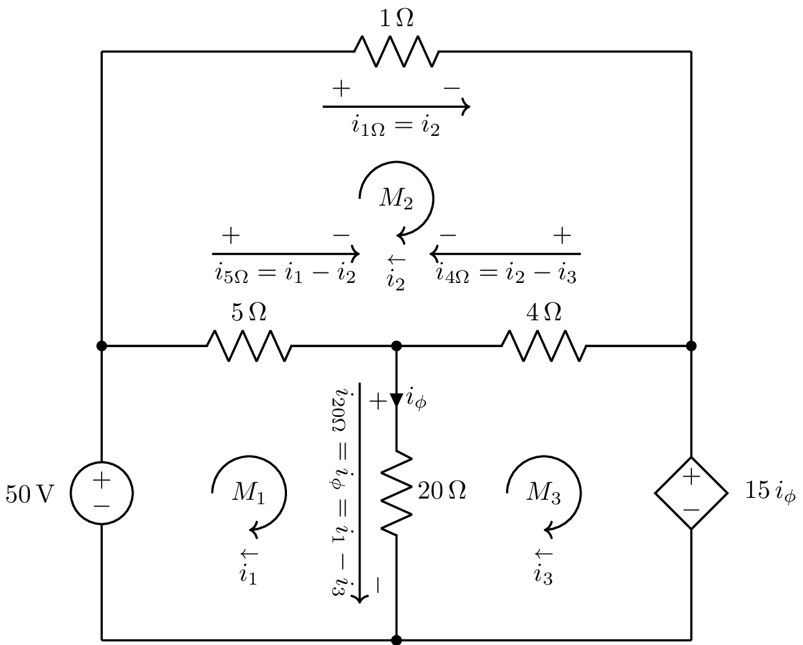

---

## Método das Correntes das Malhas - Passo 2

### Resistor de $4\Omega$

Arbitramos para a corrente \\(i_{4\Omega}\\) o sentido da direita para a esquerda, como mostra o circuito ao lado.

No resistor de \\(4\Omega\\), vemos que a corrente \\(i_2\\) da malha 2 entra na direita e sai pela esquerda, já a da malha 3, \\(i_3\\), no sentido oposto, da esquerda para a direita. Assim, a corrente \\(i_{4\Omega}\\) que passa pelo resistor de \\(5\Omega\\) é a diferença entre as correntes \\(i_2\\) e \\(i_3\\), ou seja:

\\[i_{4\Omega} = i_2 - i_3\\]

### Resistor de $20\Omega$

Arbitramos para a corrente \\(i_{20\Omega}\\) o sentido da esquerda para a direia, como mostra o circuito ao lado.

No resistor de \\(20\Omega\\), vemos que a corrente \\(i_1\\) da malha 1 entra por cima e sai por baixo, já a da malha 3, \\(i_3\\), no sentido oposto, de baixo para cima. Assim, a corrente \\(i_{20\Omega}\\) que passa pelo resistor de \\(20\Omega\\) (que também é \\(i_{\phi}\\) é a diferença entre as correntes \\(i_1\\) e \\(i_3\\), ou seja:

\\[i_{20\Omega} = i_{\phi} = i_1 - i_3\\]

<!-- _class: transparent -->

---

## Método das Correntes das Malhas - Passo 2

### Resistor de $1\Omega$

Arbitramos para a corrente \\(i_{1\Omega}\\) o sentido da esquerda para a direita, como mostra o circuito ao lado. E podemos ver que sobre ele incide apenas a corrente da malha 2, \\(i_2\\), no mesmo sentido da corrente arbitrada.

Assim: 

\\[i_{1\Omega} = i_2\\]

<!-- _class: transparent -->

---

## Método das Correntes das Malhas - Passo 3

3. Para cada malha do circuito escreva LKT considerando em cada malha:
    - As quedas (ou elevações) de tensão causadas pelo trânsito das correntes nos resistores;
    - As quedas (ou elevações) de tensão causadas pelas fontes de tensão;
    - As quedas (ou elevações) de tensão causadas pelas fontes de corrente;

### Malha \\(M_1\\)

Percorrendo a malha 1 no sentido horário após o nó superior da fonte de \\(50 \text{V}\\), temos:

\\[
\begin{align\*}
&  & -5 i\_1 + 5 i\_2 - 20 i\_1 + 20 i\_3 + 50 &= 0 \therefore \\\\
&  & -25 i\_1 + 5 i\_2 + 20 i\_3 &= -50 \therefore \\\\
&  & 25 i\_1 - 5 i\_2 - 20 i\_3 &= 50 \quad (1)
\end{align\*}
\\]

<!-- _class: transparent -->

---

## Método das Correntes das Malhas - Passo 3

### Malha \\(M_2\\)

Percorrendo a malha 2 no sentido horário após o nó inferior de \\(R = 1 \Omega\\), temos:

\\[
\begin{align\*}
&  & -i\_2 - 4 i\_2 + 4 i\_3 + 5 i\_1 - 5 i\_2 = 0 \therefore \\\\
&  & -10 i\_2 + 5 i\_1 + 4 i\_3 = 0 \therefore \\\\
&  & 10 i\_2 - 5 i\_1 - 4 i\_3 = 0 \therefore \\\\
&  & 5 i\_1 - 10 i\_2 + 4 i\_3 = 0 \quad (2)
\end{align\*}
\\]

### Malha \\(M_3\\)

Percorrendo a malha 3 no sentido horário após o nó anterior a \\(R = 4 \Omega\\), temos:

\\[
\begin{align\*}
4 i\_2 - 4 i\_3 - 15 i\_1 + 15 i\_3 + 20 i\_1 - 20 i\_3 = 0 \therefore \\\\
5 i\_1 + 4 i\_2 - 9 i\_3 = 0 \quad (3)
\end{align\*}
\\]

<!-- _class: transparent -->

---

## Método das Correntes das Malhas - Passo 4

<iframe src="https://diegoascanio.github.io/jupyterlite/lab?path=metodo-das-correntes-de-malha.ipynb" width="100%" height="100%"></iframe>

---

## Método das Correntes nas Malhas - Conclusões

### Vantagens

- Reduz o número de equações a serem resolvidas;
- Facilita a visualização do comportamento da estrutura;
- Elimina a necessidade de se lidar com a LKC nos nós.

### Desvantagens

- Sobrecarga cognitiva nas operações de montagem das equações, o que facilita a ocorrência de erros de desatenção por esquecimento de termos ou sinais;
    - Porque usando LKC nos nós, LKT nas malhas e Lei de Ohm, a montagem das equações é mais simples e direta;
- É deficiente em circuito não planares (onde cabos se cruzam) e em circuitos com fontes de corrente compartilhadas entre malhas.
- Não deve ser usado se não houver ao menos um elemento independente (não compartilhado) em cada uma das malhas.

### Exercício

Resolva o circuito anterior pelo método tradicional e aponte a quantidade de equações que o método das correntes nas malhas eliminou.

---

<!-- _class: lead -->
# Instrumentos Para Medição de Grandezas Elétricas

---

## Instrumentos de Medida - Voltímetro

- O voltímetro é um instumento que mede as tensões (diferenças de potencial) que existem entre dois pontos quaisquer em um circuito elétrico;
- Em um circuito, o voltímetro deve sempre ser ligado em paralelo ao elemento cuja tensão desejamos medir;

<!-- _class: transparent -->

- O voltímetro ideal não causa nenhuma alteração no circuito, por possuir resistência infinita;
- O voltímetro real não apresenta resistência infinita, apenas uma resistência muito grande, destarte, causa pequenas alterações no circuito;
- O voltímetro apresenta limites de tensões que consegue ler, temos de levar isso em consideração.

<!-- _class: transparent -->
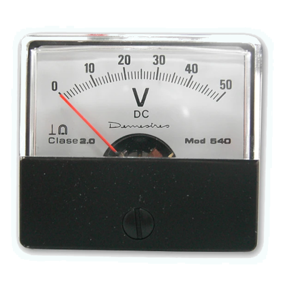
Exemplo de voltímetro analógico para tensões contínuas.

---

## Instrumentos de Medida - Amperímetro

- O amperímetro é um instumento que mede a corrente que passa em um elemento de um circuito elétrico;
- Em um circuito, o amperímetro deve sempre ser ligado em série ao elemento cuja corrente desejamos medir;

<!-- _class: transparent -->
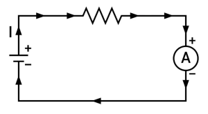

- O amperímetro ideal tem reistência nula;
- O amperímetro real não apresenta resistência nula, apenas uma resistência muito pequena, destarte, por si só causa pequenas alterações nas correntes que lê.
- Devemos nos atentar aos limites operacionais do instrumento;

<!-- _class: transparent -->
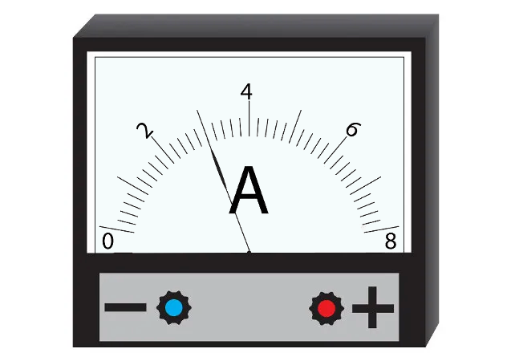
Exemplo de amperímetro analógico.

---

## Instrumentos de Medida - Ohmímetro

- O ohmímetro é um instumento que mede a resistência de um elemento em um circuito elétrico;
- Em um circuito, o ohmímetro deve sempre ser ligado aos terminais do elemento cuja resistência desejamos medir;
- O circuito deve estar desenergizado para que a medida da resistência seja correta;

<!-- _class: transparent -->

<!-- _class: transparent -->
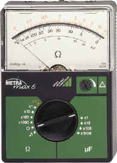
Exemplo de ohmímetro analógico.

- O ohmímetro é um elemento que dispõe de uma fonte de tensão estável $V$, que ao se conectar aos terminais de um elemento (resistor) faz circular uma corrente elétrica por ele.
- Essa corrente elétrica $I$ é medida pelo instrumento e pela lei de Ohm, ele nos mostra a resistência calculada pela equação $R = {V \over I}$.
- Devemos nos atentar aos limites operacionais do instrumento;

---

## Instrumentos de Medida - Multímetro

- O multímetro é um instumento que mede as três grandezas elétricas principais $- V, R, I -$, como também capacitância, indutância e continuidade de circuitos;
- Funciona através de pontas de prova e chaves seletoras das grandezas (e suas escalas);
- Está disponível em múltiplos preços, variando de R$ 16,00 a 2,5 salários mínimos.
- É necessário se ater a seus limites operacionais;
- Funciona da mesma forma que os outros três instrumentos e deve ser aplicado aos circuitos de acordo com o esperado para a grandeza a se medir;
    - Exemplo: em série ao elemento, se a grandeza medida for corrente, em paralelo se for tensão e em paralelo com o circuito desenergizado se for resistência;
- Disponíveis nos nossos laboratórios, serão usados na questão experimental da atividade avaliativa 1;

<!-- _class: transparent -->

<!-- _class: transparent -->
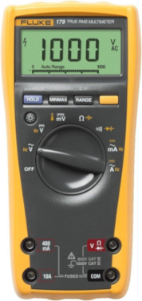
Exemplo de multímetro digital.

---

## Desafio

Os cinco primeiros estudantes que entregarem a matriz do sistema linear das correntes do circuito de exemplo dessa aula em sua forma escada pelo método de gauss, demonstrando cada operação de combinação linear entre as linhas da matriz para sua transformação na sua forma escada e em formato LATEX ganharão cinco pontos extras. Os demais que entregarem, mas, não forem os cinco primeiros, ganharão 2 pontos extras.

A forma escada difere da forma escada reduzida por linhas porque na última, todos os elementos acima e abaixo do elemento $A_{ii}$ são zero. Na forma escada, apenas os elementos abaixo de $A_{ii}$ são nulos.

---

## Lista 3 de Exercícios

Problemas 2.18 ao 2.26 do capítulo 2 do livro Circuitos Elétricos 8ª Ed. de Nilsson e Riedel e exercícios — somente os exercícios com respostas para conferência no final do livro — do capítulo 4, seções 4.1 a 4.8 do livro Circuitos Elétricos 8ª Ed. de Nilsson e Riedel.

### Respostas dos Exercícios Pares do capítulo 2 (para conferência)

2.18
- a) $i_{a} = 2A, i_{b} = 0.5A, i_{g} = 2.5A$
- os questões subsequentes derivam das respostas da a)

2.20
- a) $v_{o} = 16V, i_{0} = 8 mA$
- b) $i_{g} = 10 mA$
- c) $P = 160mW$

2.22

- a) $R = 7 \Omega$
- b) $P = 1 kW$

2.24

- a) $i_{cd} = 33.33mA, i_{ab} = i_{bd} = 66.67mA, i_{bc} = 0$
    $P_{5k\Omega} = 22.22W, P_{7.5k\Omega} = 33.33W$, 
    $P_{10k\Omega} = 11.11W, P_{15k\Omega} = 16.67W, P_{4k\Omega} = 0$
- b) A queda de tensão na fonte de corrente é de $833.33 V$ e a potência do circuito é de $83.33W$
- c) $83.33W$

2.26

- a)
$$
\begin{align}
    p_{130} &= -1950 W \\
    p_{460} &= -13800 W
\end{align}
$$

- b) A potência total fornecida é de $15750W$ e somando as potências dissipadas nos resistores, verifica-se que a potência total dissipada é igual à potência total fornecida.

---

# Para Casa!

Brincar com o sympy e o numpy para resolver sistemas lineares com variáveis simbólicas (sympy) e com variáveis numéricas (numpy).

---

Referências Bibliográficas

- RIEDEL, SUSAN A.; NILSSON, James W. - Circuitos Elétricos 10ª ed. 2015.
- MELO, EMERSON G. de. Curso: LOM3202 - Circuitos Elétricos (2020). 2020. Disponível em: https://edisciplinas.usp.br/course/view.php?id=82680. Acesso em 31 de Julho de 2023.
- Khan Academy. Curso de Engenharia Elétrica. Disponível em: https://pt.khanacademy.org. Acesso em 31 de Julho de 2023.
- CLEAVER, THOMAS G. - ECE220 Lesson 3 - Acesso em 27 de Agosto de 2023. https://engineering.louisville.edu/raise/EE220/L3.html.
- DE ARAÚJO, THABATTA M. A. - SLIDES E NOTAS DE AULAS - Acesso em 21 de Agosto de 2023. Disponível junto à profª Thabatta.

