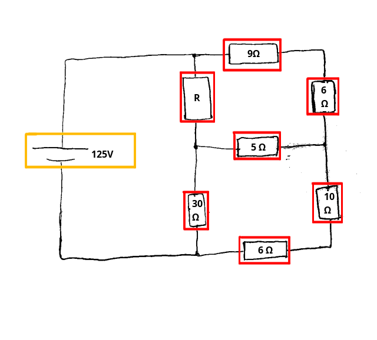

# Análise de Circuitos Elétricos
## Aula 03 - Leis de Kirchoff, Resolução de Circuitos Pelas Leis de Kirchoff e Instrumentos Para Medição de Grandezas
 
Prof. M.Sc. Diego Ascânio Santos (ascanio@cefetmg.br)

Aula baseada sobre o material do professor Dr. Emerson Gonçalves de Melo (emerdemelo@usp.br - DEMAR EEL USP), da professora Dra. Thabatta Moreira Alves de Araújo (thabatta@cefetmg.br - DIGDDV), da Khan Academy e do professor Dr. Thomas G. Cleaver (tom.cleaver@louisville.edu) da universidade de Louisville.

CEFET-MG DIGGDDV - Divinópolis, 2023.

---

# Roteiro

1. Definições, Terminações e Nomenclaturas
    1. Elementos
    2. Nós
    3. Malhas
    4. Tabela de Terminações e Nomenclaturas
2. Lei de Kirchoff da Corrente
3. Lei de Kirchoff da Tensão

---

# Roteiro

4. Análise de circuitos pelas Leis de Kirchoff da Corrente e da Tensão
    1. Método para modelagem de circuitos em Sistemas de Equações Lineares
    2. Representação dos Sistemas de Equações Lineares em Sua Forma Matricial
    3. Resolução dos Modelos de Circuitos em Equações Lineares por Sistemas Computacionais de Álgebra (CAS - sympy, numpy)

---

# Roteiro

5. Instrumentos de medida de grandezas elétricas
    1. Voltímetro (Tensão)
    2. Amperímetro (Corrente)
    3. Ohmímetro (Resistência)
    4. Multímetro (Múltiplas Grandezas)
6. Lista 3 de Exercícios

---

<!-- _class: lead -->
# Definições, Terminações e Nomenclaturas

---

    Definições - Elementos

Elementos de circuitos são os componentes presentes em um circuito elétrico como resistores, capacitores, indutores, baterias, fontes (tensão / corrente), chaves, dentre outros.

    

        <figure>
            
            <figcaption>Exemplos de Elementos de Circuitos.</figcaption>
        </figure>
        <figure>
            
            <figcaption>Circuito composto por resistor, capacitor e indutor.</figcaption>
        </figure>
    

---

    Definições - Nós

Um nó é um ponto em circuito elétrico que conecta dois ou mais de seus elementos.

    

        <figure>
            
            <figcaption>Nós em Um Circuito Elétrico </figcaption>
        </figure>
    

---

    Definições - Malhas

Um laço é qualquer caminho contínuo e fechado em um circuito que começa e termina no mesmo nó.

    <figure>
        
        <figcaption class="regular">Laços (destacados em laranja) presentes em um circuito </figcaption>
    </figure>

Uma malha é um laço (caminho contínuo e fechado em um circuito) que não apresenta outros laços dentro dele.

    <figure>
        
        <figcaption class="regular">Exemplo de Circuito Com Três Malhas Dentro Dele </figcaption>
    </figure>

---

Referência de Terminações e Nomenclaturas em Um Circuito

    

    

---

<!-- _class: lead -->
# Lembrete nº 1

<!-- _class: lead -->
## Não Adianta a Sua Matemática Estar Correta se Seu Modelo Estiver Errado!

<!-- _class: lead -->
Um circuito só está resolvido quando os valores das correntes e tensões de seus elementos são conhecidos!

---

<!-- _class: lead -->
# Lei de Kirchoff das Correntes em Um Nó

---

Lei de Kirchoff das Correntes

A Lei de Kirchhoff das Correntes diz que a soma das correntes que entram em um nó de um circuito tem de ser igual a soma das correntes que saem dele:

$$
    \sum{i_{\text{entrada}}} = \sum{i_{\text{saida}}}
$$

Considerando o nó abaixo, temos as correntes $i_{1}, i_{3} \text{ e } i_{4}$ entrando no nó, enquanto as correntes $i_{2} \text{ e } i_{5}$ saem dele.

Assim, $i_{1} + i_{3} + i_{4} = i_{2} + i_{5}$

---

<!-- _class: lead -->
# Lei de Kirchoff das Tensões em Uma Malha

---

Lei de Kirchoff das Tensões 

A Lei de Kirchhoff das Tensões diz que a soma das $n$ tensões presentes em (em torno de) uma malha fechada é zero:

$$
    \sum_{n}{V_{n}} = 0 
$$

A Lei de Kirchhoff das Tensões também pode ser descrita de outra forma: A soma dos aumentos de tensão é igual à soma das quedas de tensão em torno de uma malha fechada:
<!-- Guardem isso, pois, isso é de suma importância! -->

$$
    \sum_{V_{\text{aumento}}} = \sum_{V_{\text{queda}}} 
$$

Observe as setas laranjas, as que transitam de negativo pra positivo, representam um aumento de tensão. As que transitam de positivo para negativo, uma diminuição (subtração) da tensão.

Escrevendo a LKT desta malha pela primeira equação: $+20V - 2V - 4V - 6V - 8V = 0V$.

Considerando que a soma das tensões de queda é de $20V$, pela segunda equação, temos que $20V = 2V + 4V + 6V + 8V$

---

<!-- _class: lead -->
# Lembrete nº 2

<!-- _class: lead -->
## Não Adianta a Sua Matemática Estar Correta se Seu Modelo Estiver Errado!

<!-- _class: lead -->
Um circuito só está resolvido quando os valores das correntes e tensões de seus elementos são conhecidos!

---

# Método para determinação do sentido das correntes e das equações de malha para a obtenção de equações lineares que resolvem um circuito resistivo.

Consideramos que um circuito está resolvido quando sabemos todos os valores de seus componentes e das correntes que circulam por eles, pois aí, conseguimos derivar as demais grandezas de interesse.

---

## Método para determinação do sentido das correntes e das equações de malha para a obtenção de equações lineares que resolvem um circuito resistivo.

- Como resolver o circuito ao lado, em função de $R$ e depois, descobrir o valor de $R$ sabendo que uma corrente de $3A$ passa pelo resistor de $9\Omega$?

- Através do Algoritmo explicado nos próximos slides!

<!-- _class: transparent -->

---

## Algoritmo para resolução de circuitos pela lei de Kirchhoff (passo-a-passo) 

Dado um circuito qualquer:

1. Determine quais são os elementos (resistores e fontes) do circuito;
2. Determine quais são os nós do circuito (ponto onde dois ou mais elementos se juntam);
3. Determine quais são as malhas (Caminhos (laços) cujos nó inicial e final se coincidem sem englobar nenhum outro laço) do circuito;
4. Levando em conta a lei de Kirchhoff da corrente, que afirma que a soma das correntes entrando em um nó é igual àquelas que saem, identifique as correntes dos elementos do circuito, onde ocorrem quedas ou aumentos de tensão e o comportamento das correntes nos nós;
    - **ESSENCIAL:** Nos resistores, assinale um sinal positivo no ponto onde a corrente entra (maior tensão) e um negativo onde ela sai (menor tensão). Por fim, assinale os sinais positivos e negativos aos respectivos polos da(s) fonte(s). 

---

## Algoritmo para resolução de circuitos pela lei de Kirchhoff (passo-a-passo) 

5. Escreva as diferenças de potencial existentes em uma malha levando em consideração a lei de kirchoff da tensão, que estabelece que a soma das diferenças de potencial dos elementos de uma malha é igual a zero.
    - Aqui a sinalização dos pontos onde ocorrem quedas de pontecial nos resistores será essencial, pois:
        - Se em um ponto da malha, o caminho da malha se mover de um ponto de menor tensão (-) para um ponto de maior tensão (+) em um resistor, você deve considerar um aumento de tensão nesse caminho. 
        - Se o caminho se mover de um ponto de maior tensão para um ponto de menor tensão, você deve considerar um decréscimo de tensão no caminho da malha.
6. Escreva equações da lei de Ohm (V = Ri) para cada resistor do circuito.
7. A partir das equações de corrente obtidas em 4, 5 e 6, se você seguiu o método corretamente, você produziu um modelo matemático adequado para o comportamento de circuito e ele pode ser resolvido através de sistemas lineares. 

**Lembrando: Não adianta sua matemática estar correta se seu modelo estiver errado!**

---

## Algoritmo

### Passo 1

Considerando o circuito da figura, queremos resolvê-lo calculando o valor de todas as correntes de seus componentes em função do resistor de valor desconhecido $R$. **Para resolver o circuito ao final do algoritmo, bem como encontrar o valor de $R$, sabemos que no resistor de $9 \Omega$ passa uma corrente de $3A$.**

Ao aplicar o passo 1 do algoritmo, os resistores identificados encontram-se contornados por linhas vermelhas e a fonte identificada por uma linha laranja:

<!-- _class: transparent -->

---

## Algoritmo

### Passo 2

Ao aplicar o passo 2, identificamos 4 nós $N_{1}, N_{2}, N_{3} \text{ e } N_{4}$ (em verde escuro) no circuito.

<!-- _class: transparent -->

---

 

## Algoritmo

### Passo 3

Ao aplicar o passo 3, identificamos 3 Malhas $M_{1}, M_{2} \text{ e } M_{3}$ (em azul) no circuito.

<!-- _class: transparent -->

---

## Algoritmo

### Passo 4

Levando em conta a lei de Kirchhoff da corrente, que afirma que a soma das correntes entrando em um nó é igual àquelas que saem, identifique as correntes dos elementos do circuito e onde ocorrem quedas ou aumentos de tensão. 
- **ESSENCIAL:** Nos resistores, assinale um sinal positivo no ponto onde a corrente entra (maior tensão) e um negativo onde ela sai (menor tensão). Por fim, assinale os sinais positivos e negativos aos respectivos polos da(s) fonte(s). 

Cada elemento no circuito tem uma corrente que passa por ele. Começando pela fonte do circuito, temos uma corrente $i_{0}$ que flui do polo negativo da fonte em direção ao polo positivo. A corrente $i_{0}$ entra no nó $N_{1}$ e nesse nó ocorre uma ramificação do circuito para duas resistências: a resistência de valor indeterminado $R$ e a resistência de $9 \Omega$. 

Considerando a corrente que flui pelo resistor de $9 \Omega$ como $i_{1}$ e a corrente que flui por $R$ como $i_{2}$, como ambas $i_{1} \text{ e } i_{2}$ saem do nó $N_{1}$ e existe uma corrente $i_{0}$ que chega a este nó assim, pela LKC:

$$ i_{0} = i_{1} + i_{2} $$

<!-- _class: transparent -->

---

## Algoritmo

### Passo 4

Continuando a análise do circuito, verificamos que entre os nós $N_{1}$ e $N_{2}$ os resistores de $9 \Omega$ e de $6 \Omega$ estão em série, e portanto, possuem a mesma corrente $i_{1}$. Verificamos também que um resistor de $5 \Omega$ conecta os nós $N_{2}$ e $N_{3}$, existindo assim, uma corrente que circula neste elemento. O sentido de circulação da corrente deve ser definido arbitrariamente (a seu critério) e você pode definir tanto uma corrente $i_{3}$ que flui de $N_{2}$ para $N_{3}$ (direita para a esquerda) quanto de $N_{3}$ para $N_{2}$ (esquerda para a direita).

Nessa resolução, arbitraremos que a corrente $i_{3}$ flui de $N_{3}$ para $N_{2}$. Agora, escreveremos as equações da lei de Kirchhoff para a corrente para os nós $N_{3}$ e $N_{2}$ respectivamente. 
- No nó $N_{3}$ chega a corrente corrente $i_{2}$ que se divide para as correntes $i_{3}$ — que flui de $N_{3}$ para $N_{2}$ — e $i_{4}$ que passa no resistor de $30 \Omega$ entre $N_{3}$ e $N_{4}$.
    - Assim, a LKC no nó $N_{3}$ estabelece que $i_{2} = i_{3} + i_{4}$.
- No nó $N_{2}$ chegam as correntes $i_{1}$ e $i_{3}$ e sai uma corrente $i_{5}$ em direção aos dois resistores em série de $10 \Omega$ entre $N_{2}$ e $N_{4}$.
    - Assim, a LKC no nó $N_{2}$ estabelece que $i_{5} = i_{1} + i_{3}$

Por fim, em $N_{4}$ entram as correntes $i_{5}$ e $i_{4}$ que somadas produzem $i_{0}$ (que sai de $N_{4}$). Logo, $i_{4} + i_{5} = i_{0}$. Porém, essa equação não será utilizada, pois, é uma combinação das outras três equações de nós obtidas até o momento. Agora, devemos passar ao passo 5 - escrever as equações das tensões nas malhas $M_{1}, M_{2} \text{ e } M_{3}$ com base na lei de kirchoff da tensão.

<!-- _class: transparent -->

---

## Algoritmo

### Passo 5

Agora, devemos fazer as equações das tensões nas malhas pelos princípios da LKT que preconizam que a soma das diferenças de potencial em uma malha é sempre nula. Existe um subalgoritmo deste passo para fazer a resolução que para cada malha do circuito determina que você:

1. Escolha um elemento da malha como elemento atual
    - Na malha $M_{1}$, vamos escolher o elemento $R$.
2. Escolha um sentido (horário ou anti-horário) para percorrer a malha a partir do elemento escolhido. Escolheremos o sentido horário.

<!-- _class: transparent -->

---

## Algoritmo

### Passo 5

3. **(ESSENCIAL)** Avalie os sinais da diferença de potencial do elemento no sentido escolhido para percorrer a malha. <!-- Em \( R \) no sentido horário a tensão vai do sentido positivo ao negativo, portanto, diminuindo. se fosse no sentido anti horário, a tensão no elemento iria do negativo para o positivo, portanto, aumentando -->
    1. Se no sentido escolhido a tensão diminuir — for do $+$ para o $-$ — então coloque a tensão deste elemento como negativa na equação da malha avaliada.
    2. Se no sentido escolhido a tensão aumentar — for do $-$ para o $+$ — então coloque a tensão deste elemento como positiva na equação da malha avaliada.
- No nosso elemento atual $R$ no sentido horário a tensão diminui. Portanto adicionamos a tensão negativa deste elemento na equação da malha $M_{1}$. Assim:

$$ V_{M_{1}} = -R \cdot i_{2} + \cdots = 0 $$

<!-- _class: transparent -->

---

## Algoritmo

### Passo 5

4. Na equação $V_{M_{1}} = -R \cdot i_{2} + \cdots = 0$, as reticências ($\cdots$) representam as tensões dos outros elementos que existem na malha mas que ainda não foram calculadas. Para continuar o algoritmo, escolha o próximo elemento não visitado no sentido escolhido para percorrer a malha como elemento atual.
5. repita os passos 3 e 4 do subalgoritmo do passo 5 até que todos os elementos da malha tenham sido visitados.

Aplicando o algoritmo para os próximos elementos a serem visitados $R = 30 \Omega$ e a fonte de $125 V$, no resistor de $30 \Omega$ a tensão diminui, portanto:
$$ V_{M_{1}} = -R \cdot i_{2} - 30 \Omega \cdot i_{4} + \cdots = 0 $$

Na fonte de $125 V$, o sentido escolhido faz a tensão aumentar (vai do do $-$ para o $+$). Portanto:

$$ V_{M_{1}} = -R \cdot i_{2} - 30 \Omega \cdot i_{4} + 125 V = 0 $$

<!-- _class: transparent -->

---

## Algoritmo

### Passo 5

Aplicando o passo 5 para as próximas malhas no sentido horário temos que:

$$ 
\begin{align}
    V_{M_{2}} &= -9 i_{1} - 6 i_{1} + 5 i_{3} + R i_{2} = 0 \\
    V_{M_{3}} &= -10 i_{5} - 6 i_{5} + 30 i_{4} - 5 i_{3} = 0 \\
\end{align}
$$

<!-- _class: transparent -->

---

## Algoritmo

### Passo 6

#### Escrever equações da lei de Ohm $(V = Ri)$ para cada resistor do circuito.

Considerando que cada resistor no circuito apresenta sua própria diferença de potencial, atribua no circuito uma diferença de potencial $V_{k} = Ri_{n}$ para cada resistor, onde $k$ é uma letra qualquer do alfabeto e $i_{n}$ é a corrente que passa no resistor.

Começando pelo resistor de resistência desconhecida $R$, $V_{R_{R}} = V_{a} = R \cdot i_{2}$.

Para os demais resistores:

$$V_{R_{9 \Omega}} = V_{b} = 9 \cdot i_{1}$$
$$V_{R_{6 \Omega}} = V_{c} = 6 \cdot i_{1}$$
$$V_{R_{5 \Omega}} = V_{d} = 5 \cdot i_{3}$$

$$V_{R_{10 \Omega}} = V_{e} = 9 \cdot i_{5}$$
$$V_{R_{6 \Omega}} = V_{f} = 6 \cdot i_{5}$$
$$V_{R_{5 \Omega}} = V_{g} = 30 \cdot i_{4}$$

<!-- _class: transparent -->

---

## Algoritmo

## Passo 7

Tendo obtido equações dos elementos dos circuitos através da LKC, da LKT e da lei de Ohm, obtemos:

$$
\begin{align}
    &i_{0} = i_{1} + i_{2} \\
    &i_{2} = i_{3} + i_{4} \\
    &i_{5} = i_{1} + i_{3} \\
    &-R \cdot i_{2} - 30 \Omega \cdot i_{4} + 125V = 0 \\
    &-9 i_{1} - 6 i_{1} + 5 i_{3} + R i_{2} = 0 \\
    &-10 i_{5} - 6 i_{5} + 30 i_{4} - 5 i_{3} = 0 \\
\end{align}
$$

$$
\begin{align}
    V_{a} &= R \cdot i_{2} \\
    V_{b} &= 9 \cdot i_{1} \\
    V_{c} &= 6 \cdot i_{1} \\
    V_{d} &= 5 \cdot i_{3} \\
    V_{e} &=10 \cdot i_{5} \\
    V_{f} &= 6 \cdot i_{5} \\
    V_{g} &=30 \cdot i_{4} \\
\end{align}
$$

---

## Algoritmo

## Passo 6

Reorganizando as equações do circuito para construir um sistema linear terminamos o algoritmo de modelagem.

$$
\begin{cases}
    &1 V_{a} + 0 V_{b} + 0 V_{c} + 0 V_{d} + 0 V_{e} + 0 V_{f} + 0 V_{g} + 0 i_{0} + 0 i_{1} - R i_{2} + 0 i_{3} + 0 i_{4} + 0 i_{5} &= 0\\
    &0 V_{a} + 1 V_{b} + 0 V_{c} + 0 V_{d} + 0 V_{e} + 0 V_{f} + 0 V_{g} + 0 i_{0} - 9 i_{1} + 0 i_{2} + 0 i_{3} + 0 i_{4} + 0 i_{5} &= 0\\
    &0 V_{a} + 0 V_{b} + 1 V_{c} + 0 V_{d} + 0 V_{e} + 0 V_{f} + 0 V_{g} + 0 i_{0} - 6 i_{1} + 0 i_{2} + 0 i_{3} + 0 i_{4} + 0 i_{5} &= 0\\
    &0 V_{a} + 0 V_{b} + 0 V_{c} + 1 V_{d} + 0 V_{e} + 0 V_{f} + 0 V_{g} + 0 i_{0} + 0 i_{1} + 0 i_{2} - 5 i_{3} + 0 i_{4} + 0 i_{5} &= 0\\
    &0 V_{a} + 0 V_{b} + 0 V_{c} + 0 V_{d} + 1 V_{e} + 0 V_{f} + 0 V_{g} + 0 i_{0} + 0 i_{1} + 0 i_{2} + 0 i_{3} + 0 i_{4} - 10 i_{5} &= 0\\
    &0 V_{a} + 0 V_{b} + 0 V_{c} + 0 V_{d} + 0 V_{e} + 1 V_{f} + 0 V_{g} + 0 i_{0} + 0 i_{1} + 0 i_{2} + 0 i_{3} + 0 i_{4} - 6 i_{5} &= 0\\
    &0 V_{a} + 0 V_{b} + 0 V_{c} + 0 V_{d} + 0 V_{e} + 0 V_{f} + 1 V_{g} + 0 i_{0} + 0 i_{1} + 0 i_{2} + 0 i_{3} - 30 i_{4} + 0 i_{5} &= 0\\
    &0 V_{a} + 0 V_{b} + 0 V_{c} + 0 V_{d} + 0 V_{e} + 0 V_{f} + 0 V_{g} + 1 i_{0} - 1 i_{1} - 1 i_{2} + 0 i_{3} + 0 i_{4} + 0 i_{5} &= 0\\
    &0 V_{a} + 0 V_{b} + 0 V_{c} + 0 V_{d} + 0 V_{e} + 0 V_{f} + 0 V_{g} + 0 i_{0} + 0 i_{1} + 1 i_{2} - 1 i_{3} - 1 i_{4} + 0 i_{5} &= 0\\
    &0 V_{a} + 0 V_{b} + 0 V_{c} + 0 V_{d} + 0 V_{e} + 0 V_{f} + 0 V_{g} + 0 i_{0} - 1 i_{1} + 0 i_{2} - 1 i_{3} + 0 i_{4} + 1 i_{5} &= 0\\
    &0 V_{a} + 0 V_{b} + 0 V_{c} + 0 V_{d} + 0 V_{e} + 0 V_{f} + 0 V_{g} + 0 i_{0} + 0 i_{1} - R i_{2} + 0 i_{3} - 30 i_{4} + 0 i_{5} &= -125\\
    &0 V_{a} + 0 V_{b} + 0 V_{c} + 0 V_{d} + 0 V_{e} + 0 V_{f} + 0 V_{g} + 0 i_{0} - 15 i_{1} + R i_{2} + 5 i_{3} + 0 i_{4} + 0 i_{5} &= 0\\
    &0 V_{a} + 0 V_{b} + 0 V_{c} + 0 V_{d} + 0 V_{e} + 0 V_{f} + 0 V_{g} + 0 i_{0} + 0 i_{1} + 0 i_{2} - 5 i_{3} + 30 i_{4} - 16 i_{5} &= 0\\
\end{cases}
$$

---

## Resolução do Circuito

Agora, devemos reescrever o sistema em sua representação matricial e usar um sistema computacional de álgebra linear simbólica (sympy do python) para nos auxiliar a resolver esse circuito e encontrar as correntes em função do resistor $R$ desconhecido:

$$
\begin{equation*}
\begin{bmatrix}
1 & 0 & 0 & 0 & 0 & 0 & 0 & 0  & 0   & -R & 0   & 0   & 0   \\
0 & 1 & 0 & 0 & 0 & 0 & 0 & 0  & -9  & 0  & 0   & 0   & 0   \\
0 & 0 & 1 & 0 & 0 & 0 & 0 & 0  & -6  & 0  & 0   & 0   & 0   \\
0 & 0 & 0 & 1 & 0 & 0 & 0 & 0  & 0   & 0  & -5  & 0   & 0   \\
0 & 0 & 0 & 0 & 1 & 0 & 0 & 0  & 0   & 0  & 0   & 0   & -10 \\
0 & 0 & 0 & 0 & 0 & 1 & 0 & 0  & 0   & 0  & 0   & 0   & -6  \\
0 & 0 & 0 & 0 & 0 & 0 & 1 & 0  & 0   & 0  & 0   & -30 & 0   \\
0 & 0 & 0 & 0 & 0 & 0 & 0 & 1  & -1  & -1 & 0   & 0   & 0   \\
0 & 0 & 0 & 0 & 0 & 0 & 0 & 0  & 0   & 1  & -1  & -1  & 0   \\
0 & 0 & 0 & 0 & 0 & 0 & 0 & 0  & -1  & 0  & -1  & 0   & 1   \\
0 & 0 & 0 & 0 & 0 & 0 & 0 & 0  & 0   & -R & 0   & -30 & 0   \\
0 & 0 & 0 & 0 & 0 & 0 & 0 & 0  & -15 & R  & 5   & 0   & 0   \\
0 & 0 & 0 & 0 & 0 & 0 & 0 & 0  & 0   & 0  & -5  & 30  & -16 \\
\end{bmatrix}
\begin{bmatrix}
V_a \\ V_b \\ V_c \\ V_d \\ V_e \\ V_f \\ V_g \\ i_0 \\ i_1 \\ i_2 \\ i_3 \\ i_4 \\ i_5
\end{bmatrix}
=
\begin{bmatrix}
0 \\ 0 \\ 0 \\ 0 \\ 0 \\ 0 \\ 0 \\ 0 \\ 0 \\ 0 \\ -125 \\ 0 \\ 0
\end{bmatrix}
\end{equation*}
$$

---

## Resolução do Circuito

Para resolver o circuito no sympy construímos uma matriz extendida composta pela matriz $A$ de coeficientes do sistema acrescida da matriz $B$ de termos independentes dele (o lado direito das equações do sistema).

$$
\begin{bmatrix}
    1 & -1 & -1 & 0 & 0 & 0 & 0\\
    0 & 0 & 1 & -1 & -1 & 0 & 0\\
    0 & -1 & 0 & -1 & 0 & 1 & 0\\
    0 & 0 & -R & 0 & -30 & 0 & -125\\
    0 & -15 & R & 5 & 0 & 0 & 0\\
    0 & 0 & 0 & -5 & 30 & -16 & 0\\
\end{bmatrix}
$$

---

## Resolução do Circuito No JupyterLite pelo SymPy

<iframe src="https://diegoascanio.github.io/jupyterlite/lab?path=kirchoff.ipynb" width=100% height=100%></iframe>

---

## Resolução do Circuito

Todas as correntes do circuito em função do resistor $R$ dadas pelo sympy são:

$$

\left[\begin{matrix}1 & 0 & 0 & 0 & 0 & 0 & \frac{255 R + 4975}{53 R + 474}\\0 & 1 & 0 & 0 & 0 & 0 & \frac{255 R + 750}{53 R + 474}\\0 & 0 & 1 & 0 & 0 & 0 & \frac{4225}{53 R + 474}\\0 & 0 & 0 & 1 & 0 & 0 & \frac{2250 - 80 R}{53 R + 474}\\0 & 0 & 0 & 0 & 1 & 0 & \frac{80 R + 1975}{53 R + 474}\\0 & 0 & 0 & 0 & 0 & 1 & \frac{175 R + 3000}{53 R + 474}\end{matrix}\right]

$$

Sabemos que $i_{1} = {{255R + 750} \over {53R + 474}}$, sabemos também que $i_{1} = 3A$.

Resolvendo esta equação igual à $3A$ no sympy, obtemos $R = 7 \Omega$.

Substituindo $R$ por $7 \Omega$ em todas as outras equações de corrente obtemos:

$$
\begin{align}
    i_{0} = 8A \\
    i_{1} = 3A \\
    i_{2} = 5A \\
    i_{3} = 2A \\
    i_{4} = 3A \\
    i_{5} = 5A \\
\end{align}
$$

Portanto, agora o circuito está resolvido, pois, é possível calcular todas as grandezas elétricas associadas a seus elementos.

---

<!-- _class: lead -->
# Instrumentos Para Medição de Grandezas Elétricas

---

## Instrumentos de Medida - Voltímetro

- O voltímetro é um instumento que mede as tensões (diferenças de potencial) que existem entre dois pontos quaisquer em um circuito elétrico;
- Em um circuito, o voltímetro deve sempre ser ligado em paralelo ao elemento cuja tensão desejamos medir;

<!-- _class: transparent -->

- O voltímetro ideal não causa nenhuma alteração no circuito, por possuir resistência infinita;
- O voltímetro real não apresenta resistência infinita, apenas uma resistência muito grande, destarte, causa pequenas alterações no circuito;
- O voltímetro apresenta limites de tensões que consegue ler, temos de levar isso em consideração.

<!-- _class: transparent -->

Exemplo de voltímetro analógico para tensões contínuas.

---

## Instrumentos de Medida - Amperímetro

- O amperímetro é um instumento que mede a corrente que passa em um elemento de um circuito elétrico;
- Em um circuito, o amperímetro deve sempre ser ligado em série ao elemento cuja corrente desejamos medir;

<!-- _class: transparent -->

- O amperímetro ideal tem reistência nula;
- O amperímetro real não apresenta resistência nula, apenas uma resistência muito pequena, destarte, por si só causa pequenas alterações nas correntes que lê.
- Devemos nos atentar aos limites operacionais do instrumento;

<!-- _class: transparent -->

Exemplo de amperímetro analógico.

---

## Instrumentos de Medida - Ohmímetro

- O ohmímetro é um instumento que mede a resistência de um elemento em um circuito elétrico;
- Em um circuito, o ohmímetro deve sempre ser ligado aos terminais do elemento cuja resistência desejamos medir;
- O circuito deve estar desenergizado para que a medida da resistência seja correta;

<!-- _class: transparent -->

<!-- _class: transparent -->

Exemplo de ohmímetro analógico.

- O ohmímetro é um elemento que dispõe de uma fonte de tensão estável $V$, que ao se conectar aos terminais de um elemento (resistor) faz circular uma corrente elétrica por ele.
- Essa corrente elétrica $I$ é medida pelo instrumento e pela lei de Ohm, ele nos mostra a resistência calculada pela equação $R = {V \over I}$.
- Devemos nos atentar aos limites operacionais do instrumento;

---

## Instrumentos de Medida - Multímetro

- O multímetro é um instumento que mede as três grandezas elétricas principais $- V, R, I -$, como também capacitância, indutância e continuidade de circuitos;
- Funciona através de pontas de prova e chaves seletoras das grandezas (e suas escalas);
- Está disponível em múltiplos preços, variando de R$ 16,00 a 2,5 salários mínimos.
- É necessário se ater a seus limites operacionais;
- Funciona da mesma forma que os outros três instrumentos e deve ser aplicado aos circuitos de acordo com o esperado para a grandeza a se medir;
    - Exemplo: em série ao elemento, se a grandeza medida for corrente, em paralelo se for tensão e em paralelo com o circuito desenergizado se for resistência;
- Disponíveis nos nossos laboratórios, serão usados na questão experimental da atividade avaliativa 1;

<!-- _class: transparent -->

<!-- _class: transparent -->

Exemplo de multímetro digital.

---

## Desafio

Os sete primeiros estudantes que entregarem a matriz do sistema linear das correntes do circuito de exemplo dessa aula em sua forma escada pelo método de gauss, demonstrando cada operação de combinação linear entre as linhas da matriz para sua transformação na sua forma escada e em formato LATEX ganharão um ponto e meio extras.

A forma escada difere da forma escada reduzida por linhas porque na última, todos os elementos acima e abaixo do elemento $A_{ii}$ são zero. Na forma escada, apenas os elementos abaixo de $A_{ii}$ são nulos.

---

## Lista 3 de Exercícios

Problemas 2.18 ao 2.24 do capítulo 2 do livro Circuitos Elétricos 8ª Ed. de Nilsson e Riedel.

### Respostas dos Exercícios Pares (para conferência)

2.18
- a) $i_{a} = 2A, i_{b} = 0.5A, i_{g} = 2.5A$
- os questões subsequentes derivam das respostas da a)

2.20
- a) $v_{o} = 16V, i_{0} = 8 mA$
- b) $i_{g} = 10 mA$
- c) $P = 160mW$

2.22

- a) $R = 7 \Omega$
- b) $P = 1 kW$

2.24

- a) $i_{cd} = 33.33mA, i_{ab} = i_{bd} = 66.67mA, i_{bc} = 0$
    $P_{5k\Omega} = 22.22W, P_{7.5k\Omega} = 33.33W$, 
    $P_{10k\Omega} = 11.11W, P_{15k\Omega} = 16.67W, P_{4k\Omega} = 0$
- b) A queda de tensão na fonte de corrente é de $833.33 V$ e a potência do circuito é de $83.33W$
- c) $83.33W$

